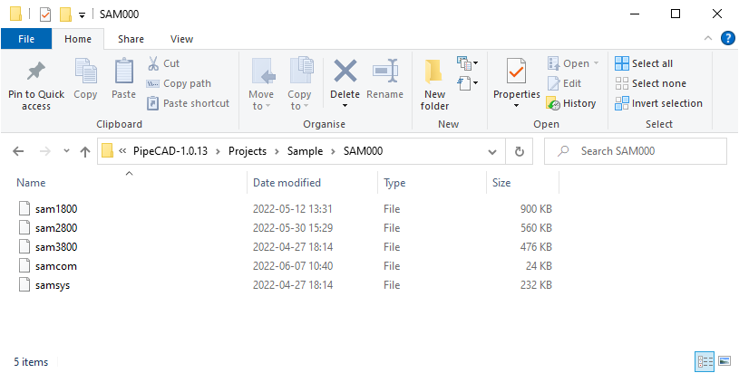

# Module Admin - User Guide

## Project Information
Enter the management Admin module to view the project information. The project information is the descriptive information of the project, such as project name, project code, project description, etc. The project information is filled in when the project is created. If you need to modify the project information, you can open the project information dialog box in the Admin panel to modify the project information. 

## Teams Management
For factory projects, the division of labor and collaborative design is generally carried out according to specialties, systems and regions, and the management of grouping teams is used in the PipeCAD software. By grouping users and databases, the project design modeling of the whole plant is finally realized. 

It can also be used to control the read and write permissions of users by grouping Teams. Only users included in the grouped Team can read and write permissions to the grouped database, while other users in the project have only read permissions. A user can belong to multiple groups. 

## Databases Management
PipeCAD is a 3D design software with project data as the core, and the design modeling data is stored in the form of a database. In the management module Admin, you can create the required database Database as needed. The database belongs to the group Team, and the group must be specified first when creating the database. The database command rules are: TeamName/DatabaseName. A group Team can contain multiple databases, such as component library, design library, etc. The interface for creating a database is as follows: 

When creating a database, you need to specify the database name and type, and you can also create a base node of the database, corresponding to the design database, you can create a SITE. Each database also has a project-unique number, DB Number. This number can be entered by yourself or automatically generated by the system. After the creation is completed, a database file named with the project code and database number will be generated. 

## Workspace Management
In PipeCAD, the engineering design has been decomposed by grouping Team, and the engineering design can be further decomposed through the workspace MDB. MDB (Multiple Databases) literally means a collection of databases. When a user selects an MDB when logging in, the user can only see the database in this MDB, but not other databases in the project. Through the workspace MDB, the read and write permissions of the data are controlled. If the data in a workspace is allowed to display data related to its work content as much as possible, it does not need to be the data of the entire project. 

Enter the name and description when creating the MDB, and then select the database DB that belongs to the MDB in this workspace. The database order in the workspace MDB is the display order in the design navigation Design Explorer. The database order in the workspace affects the creation of the first element of the database. When the first element is created, the write database can be placed first in the same type of database. So for convenience, when creating the database Database, provide the function of creating the first element. 

## User Management
You also need to enter the username and password on the login interface of PipeCAD. The management of this data is in the User section. There are two types of user rights: General and Free. When creating a project, a system administrator SYSTEM with Free permissions will be created by default, and the password is 6 uppercase Xs. Users with Free authority belong to the system administrator, and can enter all modules, and have the authority to read and write all databases. General users can only access the Paragon and Design modules, but not the management module Admin. Users can only have read and write permissions for the databases that belong to the group. 

When creating a user, you need to enter a user name and password, select user permissions, and specify which Team the user belongs to. 

## Import Project Definition from Excel
To simplify and accelerate process of project setup, administrator can import project definition file using menu:    

After pressing button import form will be shown:

By pressing button **Explorer** you need to define location of project definition file (by default, folder **%TEMPLATES_DIR%** will be opened):

Project definition file contais data for creating users, teams, databases and mdbs:

After selecting file, utility will start importing data and creating elements which are missing in the project. In case of correct import icons will be colored by Green:  

in versus case icons will be colored by Red:

## Expunge User Session
On module Admin panel, you can view the user information logged in the current project. To open form click the User Process button:

When the user exits the program abnormally, the process information will be left here. The project administrator selects the users to be kicked out in the user process list, and clicks OK to kick these users out.