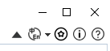

# Customisation of ribbon menu
PipeCAD has ribbon menu which be customised using Customize Dialog form. 
To add new menu there will need to do 2 steps:

To do it there will need to update uic file (for example: PipeCAD.Design.uic ) by adding new line:
```xml
	<Action Key="run_sample" Text="Run Sample" Icon=":/PipeCad/Resources/project_import.png" ToolTip="Run Sample" Module="omp.sample" Function="omp.sample.ShowSample()" />
```
After that in module where you need to add button for calling utility open Ribbon menu editor by pressing button Customisation  located in right top conner of ribbon:

