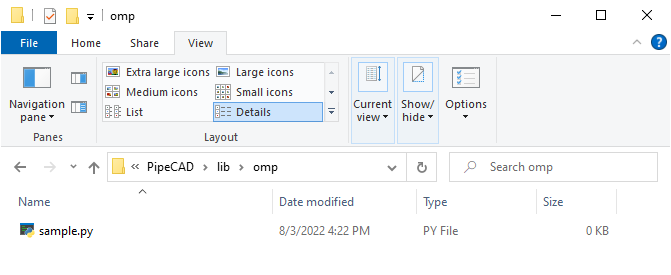

# Developing of new utility

## Code development
Each developer can evaluate his own macros library for using inside PipeCAD. In this case all macros have to be placed in dedicated folder inside folder **%PYTHONPATH%**. For example, developer's library will be named **omp** and placed in default library folder of PipeCAD:
  

Inside sample.py will write next code of new utility:
```python 
from PythonQt.QtCore import *
from PythonQt.QtGui import *

from pipecad import *

class dlgSample(QDialog):
    def __init__(self, parent = None):
        QDialog.__init__(self, parent)
        self.setupUi()
    # __init__

    def setupUi(self):
        self.resize(500, 30)
        self.setWindowTitle(self.tr("PipeCAD - Sample Utility"))

        self.verticalLayout = QVBoxLayout(self)
        self.lblText = QLabel("Sample Form Text")
        self.verticalLayout.addWidget(self.lblText)
    # setupUi

# Singleton Instance.
aSample = dlgSample(PipeCad)

def show():
    aSample.show()
# Show
```

## Calling Utility in PipeCAD
For loading utility there needs to run command for importing utility module into PipeCAD:
```python 
import omp.sample as sm
```
Abbreviation **sm** is used  to simplify next using of this module. After importing module there will be possible to show utility form on screen:
```python 
sm.show()
```

  

or it can be added button to ribbon menu (see [Customisation of ribbon menu](../common/ribbon_customisation.md) ). 
 
In result form will be shown: 


As during updating of python files it could be useful to reload utility during current session w/out restarting PipeCAD. To do it there will need to run next commands: 
```python 
import imp
imp.reload(omp.sample)
```
or (as it was used abbreviation sm to replace whole name omp.sample)
```python 
import imp
imp.reload(sm)
```

The same action can be done using menu **Development -> Reload Libraries**:

 

which will show form **Reload Python Libraries**:

  

Inside filter you will need to input name of python library/utility, which needs to reload (in our case developed utility **omp.sample**):

 

In case of correct reloading of form file, you will see next message:


After that form can be started again via menu (if setuped) or using again coommand:
```python 
sm.show()
```


