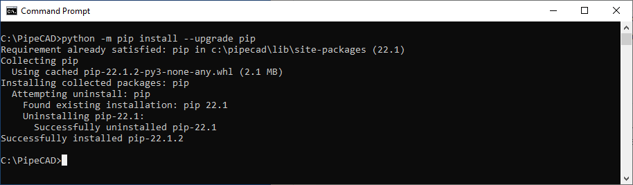
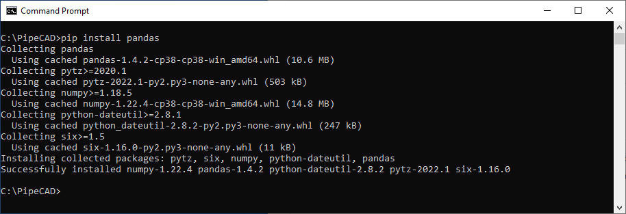

# Python Libraries in PipeCAD
Using PIP module can be easily installed third-party modules of Python, such as Excel read-write module Pandas, which is convenient to generate material tables; computer vision module OpenCV; artificial intelligence AI module Caffe, TensorFlow and other machine learning frameworks.

## Update PIP application
Before installation of any new python packages there needs to upgrade PIP utility to the latest version. In command line type command:
```batch
python -m pip install --upgrade pip 
```


Updates will be downloaded into folder **%PIPECAD_EXE%\Scripts**. 

## Installing Python packages
To install python library using PIP utility there is need to type command (e.g., for installing package Pandas ):
```batch
pip install pandas
```


New package will be downloaded to folder **%PIPECAD_EXE%\Lib\site-packages**. List of availible Python packages for installation can be found on site of PIP utility - https://pypi.org/

## Loading of Python script
For loading Python script (for ex. C:\Data\PythonLoad.py) there will use next command:
```python
    exec(open("C:\Data\PythonLoad.py",encoding='utf8').read())
```
