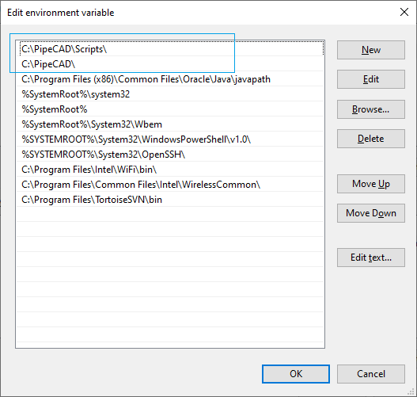

# Python Libraries in PipeCAD
Using PIP module can be easily installed third-party modules of Python, such as Excel read-write module Pandas, which is convenient to generate material tables; computer vision module OpenCV; artificial intelligence AI module Caffe, TensorFlow and other machine learning frameworks.

## Update PIP application
Before installation of any new python packages there is need to upgrade PIP utility to the latest version. 
In command line window there is need to go to root folder of PipeCad (e.g. C:\PipeCAD) and type command: 
```batch
python -m pip install --upgrade pip 
```



Updates will be downloaded into folder **%PIPECAD_EXE%\Scripts**. 

## Installing Python libraries


## Loading of Python script
For loading Python script (for ex. C:\Data\PythonLoad.py) there will use next command:
```python
    exec(open("C:\Data\PythonLoad.py",encoding='utf8').read())
```
