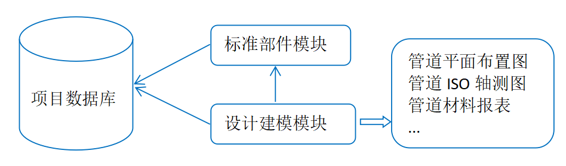

# PipeCAD User Guide {#pipecad_user_guide}

## Functional Overview
The three-dimensional pipeline design software PipeCAD is the pipeline layout design system, which is suitable for factories, construction, petrochemicals, environmental protection medicine and other industries. In the pipeline design, according to the pipeline instrument flow chart (P&ID), equipment layout plan and related drawings and materials of civil engineering, instrumentation, electrical, pump and other aspects, the pipeline is reasonably arranged and designed. The pipeline layout design should first meet the process requirements, facilitate installation, operation and maintenance, and be reasonable, neat and beautiful. 3D modeling of piping enables collision-free design and rapid production of deliverables, reducing rework and increasing design efficiency. 

The software adopts an independent 3D graphics platform and does not depend on other third-party CAD platforms (such as AutoCAD, etc.). Through parametric design, the design data is saved to the database to form a product database with the project database as the core. The product database provides the data basis for generating drawings and material reports, and also provides the data source for the digital delivery of the factory. 

As shown in the figure above, the parametric component library and design modeling data are saved in the database. When generating the deliverables, the required data is extracted from the database, and piping drawings and material reports are generated.

PipeCAD is mainly divided into three modules, namely the project management Admin module, the parameter component Paragon module and the design modeling Design module.

* Project management module: create users and databases, and manage users' access rights to databases.

* Parametric component module: Through the data input of the form, the parameterized component can be quickly generated, and the pipeline and structure can be managed hierarchically. In the parametric component library module Paragon, the creation of standard parametric pipe fittings is simplified into the form of tabular data input, which reduces the workload of engineering data preparation and improves efficiency and accuracy. 

* Design modeling module: Create a three-dimensional module for the factory in the Design modeling Design module. Factory models mainly include the following types:
        Grid: It is convenient for the positioning of various professional models;
        Equipment: various towers, tanks, heat exchangers, containers, etc. The equipment includes a nozzle, which is convenient for pipe connection and positioning;
        Structure: frame structure, workshop, equipment platform ladder, railing, etc.;
        Pipe Piping: models of pipes, air ducts, etc. that connect equipment;
        Hanger&Support: brackets for pipes, air ducts, etc.;

The data generated by the interactive operation of the plant design are stored in the project database. 

Based on the project database, the required data can be extracted to generate the design deliverables: drawings and material reports, as well as other data required for digital delivery.

PipeCAD also combines Python to provide flexible secondary development functions for the software, which is convenient for software function expansion. Users can use Python scripts to customize and develop new functions according to their own needs. 

# Contents
## Installation
[Software and Hardware Requirements](./installation/requirements.md)

[Installation on Windows](./installation/windows.md)

[Installation on Linux](./installation/linux.md)

## Project Setup
[New Project Creation](./installation/new_project.md)

[Existing Project Connection](./installation/existing_project.md)

[System Variables of PipeCAD](./installation/system_variables.md)

[Login to Project](./installation/login_to_project.md)

## User Guides
[Module Design](./design/user_guide.md)

[Module Paragon](./paragon/user_guide.md)

[Module Admin](./admin/user_guide.md)

[Keyboard shortcuts](./common/keybord_shortcuts.md)

## Development
[PipeCAD API](./development/api.md)

[Python Plugins](./development/plugins.md)

[Developing of new utility](./development/new_utility.md)

[Customisation of Ribbon menu](./common/ribbon_customisation.md)

## Video Training Examples

It is recommended that you take a look at the video tutorial before using PipeCAD.

1. [Download and install PipeCAD](https://www.bilibili.com/video/BV1u3411e7hD)
2. [PipeCAD Project Management](https://www.bilibili.com/video/BV11Q4y1r7zG?share_source=copy_web)
3. [PipeCAD standard parts](https://www.bilibili.com/video/BV1144y1u7Rc?share_source=copy_web)
4. [PipeCAD equipment modeling](https://www.bilibili.com/video/BV1Xq4y1r7Gw?share_source=copy_web)
5. [PipeCAD Structural Modeling]()
6. [PipeCAD Pipe Modeling](https://www.bilibili.com/video/BV1sL411s7B5?share_source=copy_web)
7. [PipeCAD pipe ISO drawing](https://www.bilibili.com/video/BV1nY411s7jp)
8. [PipeCAD piping layout drawing]()
9. [PipeCAD secondary development]()
