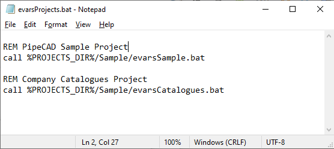
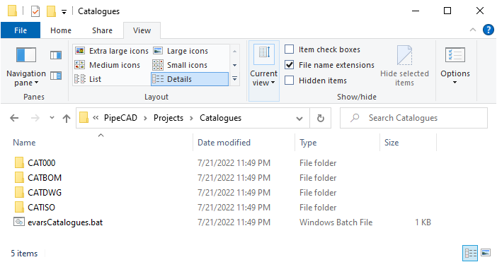
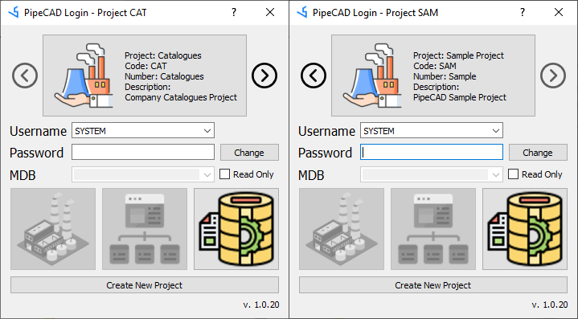

# Connecting to Existing Project
To connect already existing project there is need to add path of required project to evarsProjects.bat, which is located in folder %PROJECTS_DIR%.

 

Existing project can be located in any folder, but it will be better practice to save all project in folder %PROJECTS_DIR%.

After updating evarsProjects.bat "new" project will be availible for selection in login form by pressing buttons  or 

