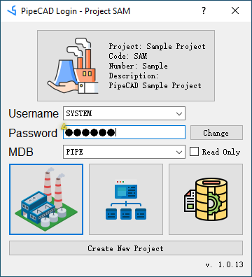

# Login to Project
Double-click the PipeCAD shortcut icon or directly run PipeCAD.bat in the installation directory to start the software. After PipeCAD starts, the login interface is displayed: 

* Project: Select the project name to be logged in;
* Username/Password: Select the user and enter the corresponding password to log in. Each project has a default administrator user SYSTEM, and the default password is XXXXXX (6 uppercase English letters X). User passwords can be configured in the project management Admin module;
* Database group (MDB): Select the database group MDB to log in;
* Module: Select the model to log in. There are currently three modules: project management module Admin, parametric component library module Paragon and design modeling module Design.
