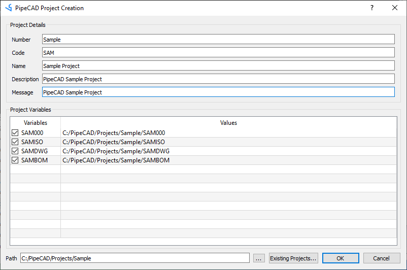
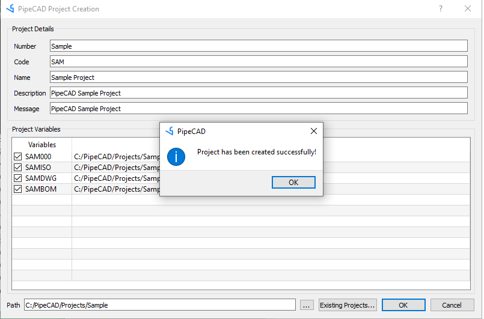
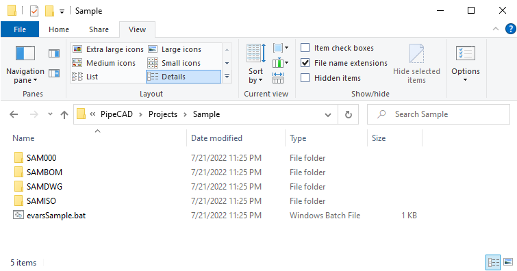
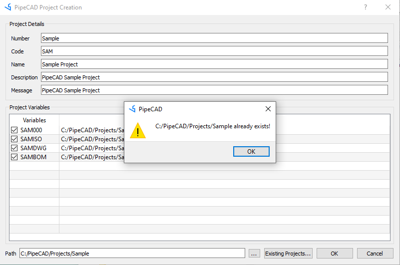
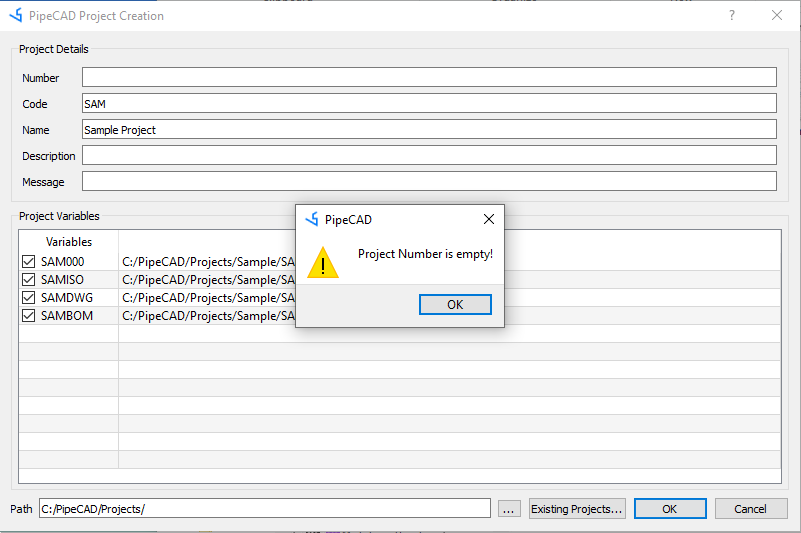

# New Project Creation
Start the project creation program by running the batch file ProjectCreation.bat in the installation directory or the Create Project button on the login screen. Enter the project number, name, code and description, project storage path and other information. Where project number Number is the name of the project root folder; project code Code is a three-capital letter code that does not conflict with other projects. The project environment variable configuration Project Variables is used to set the folder path required by the project, which is automatically generated according to the project code Code.

Click the OK button to create the project, if the project is successfully created, a prompt message will be given as shown below:  

And generate the database files and other configuration files required by the project in the project folder: 

The batch file evarsSample.bat is the environment variable configuration file of the path required by the project. When creating an existing project, a prompt is given: 

When the data that must be entered is not entered, a prompt is also given: 

