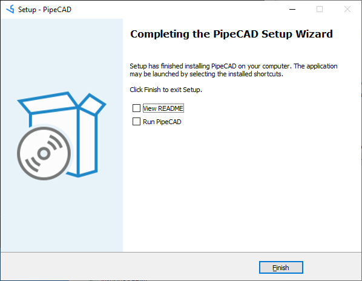

## Installation PipeCAD on Windows 
All installation process have to be done under Local Administrator account (in case of installing software in default folder **%programfiles%** or on system drive).
After starting installation process you will see next window and need to press button **Next**: 

You need you to agreed with License Agreement and press button **Next** to continue installation process:

On this step you need to select installation folder and to press button **Next**:

After checking installation details you need to press button **Install**:

When utility will complete installation process you can check box to read README file or start application after closing installation utility.   

