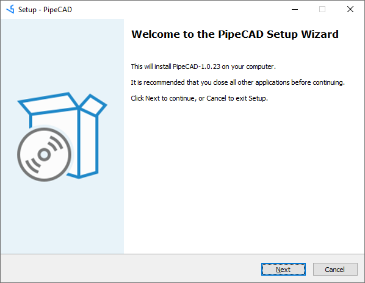
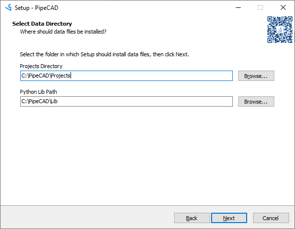
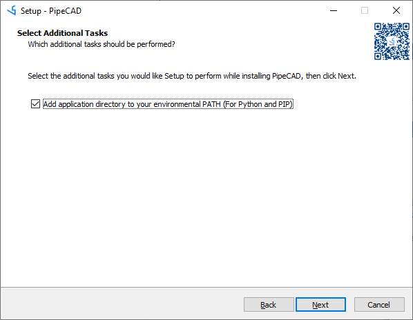
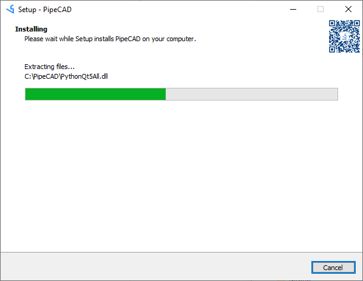

## Installation PipeCAD on Windows 
All installation process have to be done under Local Administrator account (in case of installing software in default folder **%PROGRAMFILES%** or on system drive).
After starting installation process you will see next window and need to press button **Next**: 

You need you to agree with License Agreement and press button **Next** to continue installation process:

Next step requires to select installation folder (or confirm default path) and to press button **Next**:

PipeCAD supports installation of libraries and projects in different folders in case if it's required by company's work procedure. So on this step it possible to define paths where it will be located Projects files and Python Libraries. A folder can be selected by pressing the button **Browse**:

In case if Python is not installed on PC, there is need to add path to PipeCAD folders to system variable **%PATH%**. It will allow to use embedded Python for running scripts:

After checking installation details you need to press button **Install**:

Installation process will take some time, during which installer will copy files and create sample project:

When utility will complete installation process you can check box to read REARM or start application after closing installation utility.   

