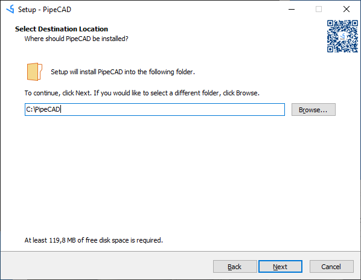

## Installation PipeCAD on Windows 
All installation process have to be done under Local Administrator account (in case of installing software in default folder **%programfiles%** or on system drive).
After starting installation process you will see next window and need to press button **Next**: 

You need you to agreed with License Agreement and press button **Next** to continue installation process:

On this step you need to select installation folder and to press button **Next**:

On next step there needs to define where will be located Projects files and Python Libraries. Folder can be select by pressing button **Browse**:

In case if Python is not installed on PC, pressing checkbox will allow adding path to embedded Python. It will allow to use embedged Python for running sctipts:

After checking installation details you need to press button **Install**:

When utility will complete installation process you can check box to read README file or start application after closing installation utility.   

