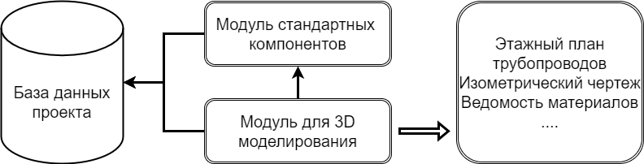
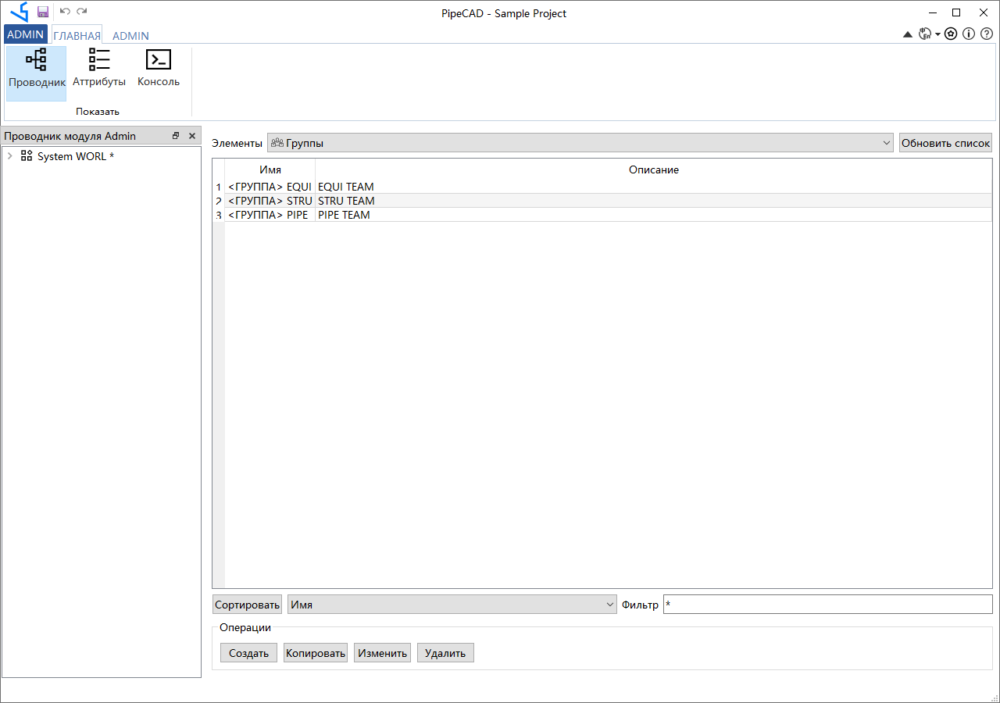

# Руководство пользователя PipeCAD 

## Функциональный обзор
Программное обеспечение для трехмерного проектирования трубопроводов PipeCAD — это система проектирования трубопроводов, которая подходит для заводов, строительства, нефтехимии, медицины для защиты окружающей среды и других отраслей промышленности. При проектировании трубопровода, в соответствии с блок-схемой приборов трубопровода (P&ID), планом размещения оборудования и соответствующими чертежами и материалами по гражданскому строительству, контрольно-измерительным приборам, электрическим, насосным и другим аспектам, трубопровод разумно устроен и спроектирован. Проект компоновки трубопровода должен в первую очередь соответствовать технологическим требованиям, облегчать установку, эксплуатацию и техническое обслуживание, а также быть разумным, аккуратным и красивым. 3D-моделирование трубопроводов обеспечивает проектирование без столкновений и быстрое производство готовых изделий, сокращая количество переделок и повышая эффективность проектирования.

Программное обеспечение использует независимую платформу 3D-графики и не зависит от других сторонних CAD-платформ (таких как AutoCAD и т. д.). При параметрическом проектировании проектные данные сохраняются в базе данных для формирования базы данных продукта, в основе которой лежит база данных проекта. База данных продуктов обеспечивает базу данных для создания чертежей и отчетов о материалах, а также обеспечивает источник данных для цифровой поставки фабрики.

Как показано на рисунке выше, библиотека параметрических компонентов и данные моделирования конструкции сохраняются в базе данных. При создании результатов необходимые данные извлекаются из базы данных, создаются чертежи трубопроводов и отчеты по материалам.

PipeCAD в основном разделен на три модуля, а именно модуль администрирования управления проектом, Модуль каталогов - Paragon компонента параметров и модуль дизайна моделирования дизайна.

* Модуль управления проектами: создание пользователей и баз данных и управление правами доступа пользователей к базам данных.

* Модуль параметрического компонента: посредством ввода данных формы можно быстро сгенерировать параметризованный компонент, а конвейером и структурой можно управлять иерархически. В модуле библиотеки параметрических компонентов Paragon создание стандартных параметрических фитингов трубопроводов упрощено до табличного ввода данных, что снижает трудоемкость подготовки инженерных данных и повышает эффективность и точность.

* Модуль 3D моделирования: Создайте трехмерный модуль завода в модуле проектирования Design. Проектная модель в основном включает в себя следующие типы:
        Сетка: Удобна для позиционирования различных 3d моделей;
        Оборудование: различные градирни, резервуары, теплообменники, контейнеры и т.д. Оборудование включает в себя штуцеры, которые удобны для подсоединения и позиционирования труб;
        Металлические конструкции: каркасная конструкция, фермы, лестницы платформы оборудования, перила и т.д.;
        Трубопроводы: модели труб или воздуховодов соединяющих оборудование;
        Подвески и опоры: кронштейны для труб, воздуховодов и т.д.;

Данные, созданные в результате работы по проектированию модели, сохраняются в базе данных проекта.

На основе базы данных проекта можно извлечь необходимые данные для получения результатов проектирования: чертежи и отчеты о материалах, а также другие данные, необходимые для строительства.

PipeCAD также включает в себе модуль Python для обеспечения возможности разработки дополнительных программных модулей, что удобно для расширения функционала программного обеспечения. Пользователи могут использовать макросы Python для настройки и разработки новых функций в соответствии со своими потребностями.

# Содержание
## Установка
[Требования к программному и аппаратному обеспечению](./installation/requirements.md)

[Установка в Windows](./installation/windows.md)

[Установка в Linux](./installation/linux.md)

## Настройка проекта
[Создание нового проекта](./installation/new_project.md)

[Подключение существующего проекта](./installation/existing_project.md)

[Системные переменные, используемые в PipeCAD](./installation/system_variables.md)

[Авторизация в проекте](./installation/login_to_project.md)

## Руководства пользователя
[Модуль 3d моделирования - Design](./design/user_guide.md)

[Модуль каталогов - Paragon](./paragon/user_guide.md)

[Модуль администрирования - Admin](./admin/user_guide.md)

[Горячие клавиши](./common/keybord_shortcuts.md)

## Разработка дополнительного функционала
[PipeCAD API](./development/api.md)

[Подключение дополнительных библиотек Python](./development/plugins.md)

[Разработка новой утилиты](./development/new_utility.md)

[Настройка ленточного меню](./common/ribbon_customisation.md)

## Обучающие ролики

Перед использованием PipeCAD рекомендуется просмотреть обучающее видео.

1. [Скачивание и установка PipeCAD](https://www.bilibili.com/video/BV1u3411e7hD)
2. [Настройка проекта в PipeCAD](https://www.bilibili.com/video/BV11Q4y1r7zG?share_source=copy_web)
3. [Стандартные библиотеки в PipeCAD](https://www.bilibili.com/video/BV1144y1u7Rc?share_source=copy_web)
4. [Моделирование оборудования PipeCAD](https://www.bilibili.com/video/BV1Xq4y1r7Gw?share_source=copy_web)
5. [Моделирование металлоконструкций в PipeCAD]()
6. [Моделирование трубопроводов в PipeCAD](https://www.bilibili.com/video/BV1sL411s7B5?share_source=copy_web)
7. [Выпуск изометрических чертежей трубопроводов в PipeCAD](https://www.bilibili.com/video/BV1nY411s7jp)
