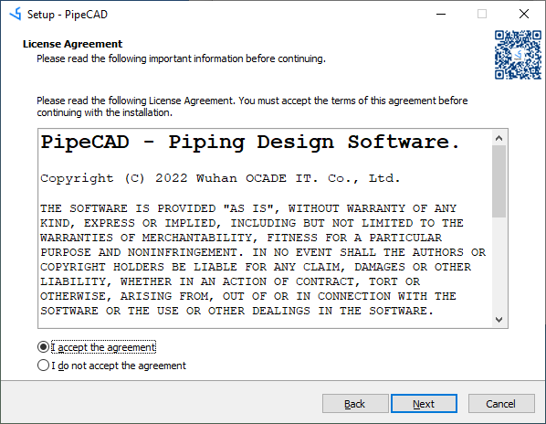
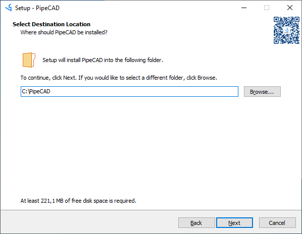
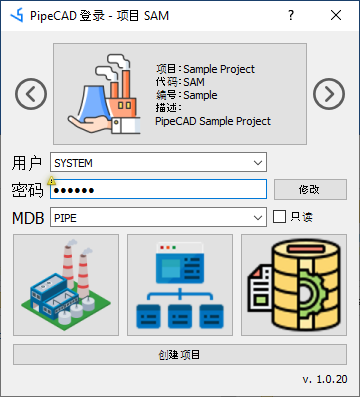
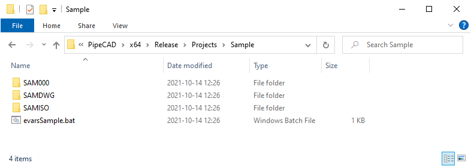
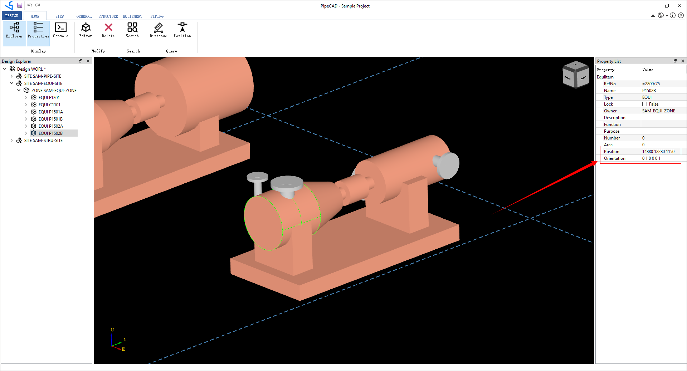
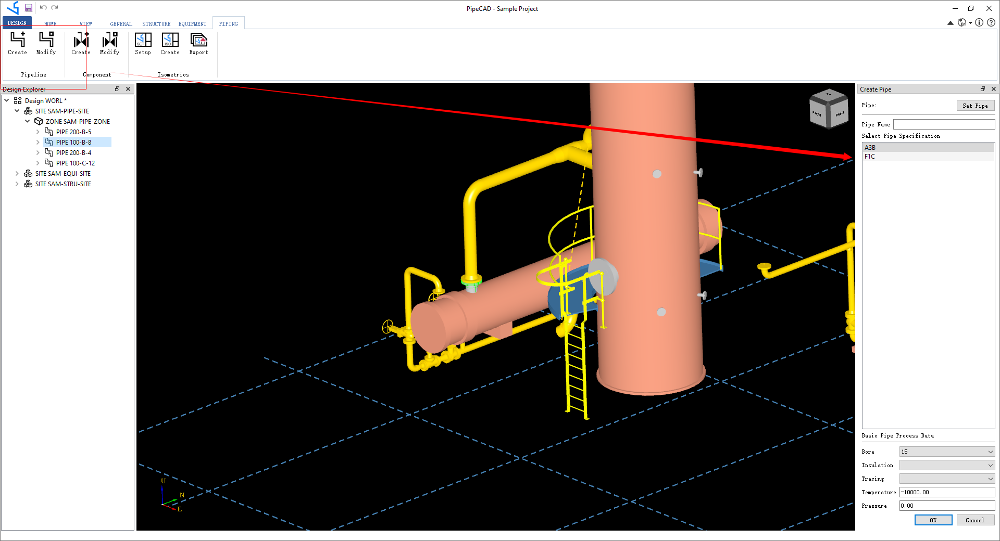
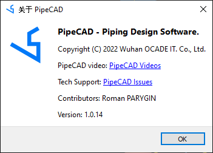

# PipeCAD User Guide {#pipecad_user_guide}

# 软件概述

三维管道设计软件PipeCAD即管道布置设计系统，适用于石油化工、环保医药、工厂建筑等行业。管道设计中根据管道仪表流程图（P&ID）、设备布置图及有关的土建、仪表、电气，机泵等方面的图纸和资料为依据，对管道进行合理布置设计。管道布置设计首先应满足工艺要求，便于安装操作和维修，并要合理、整齐美观。通过管道三维建模，可以实现无碰撞的设计并快速生成可交付的成果，从而减少返工，提高设计效率。


软件采用独立的三维图形平台，不依赖其他第三方CAD平台（如AutoCAD等）。通过参数化设计，将设计数据保存到数据库，形成以项目数据库为核心的产品数据库。产品数据库为生成图纸及材料报表提供数据基础，也可为工厂数字化交付提供数据来源。


如上图所示，将参数化部件库及设计建模数据都保存到数据库中，在生成交付成果时，从数据库中提取所需数据，生成管道图纸及材料报表等。

PipeCAD主要分为三个模块，分别是项目管理Admin模块，参数部件Paragon模块和设计建模Design模块。
- 项目管理模块：创建用户和数据库，及用户对数据库的访问权限管理等。


- 参数部件模块：通过表格的数据输入，快速生成参数化部件，以及对管道，结构进行等级管理。在参数化部件库模块Paragon中将标准参数化管件的创建简化成表格数据输入的形式，减少工程数据准备的工作量，提高效率和准确性。


- 设计建模模块：在设计建模Design模块中对工厂建立三维模块。工厂模型主要包含以下几种类型：
    - 轴网Grid：方便各专业模型定位；
    - 设备Equipment：各种塔、罐、换热器、容器等。设备包含管嘴，方便管道连接定位；
    - 结构Structure：框架结构、厂房、设备平台梯子、栏杆扶手等；
    - 管道Piping：连接设备的管道、风管等模型；
    - 支吊架Hanger&Support：管道、风管等的支架；


通过友好的交互操作产生工厂设计的数据保存到项目数据库中，如使用模型编辑器来调整模型位置。


根据项目数据库，可以提取所需要的数据生成交付的设计成果：图纸和材料报表，以及数字化交付需要的其他数据。

PipeCAD还结合Python为软件提供灵活的二次开发功能，方便软件功能扩展。Python是面向对象的脚本语言，并且有很多Python的第三方库，如表格数据处理库pandas，DXF读写库ezdxf，等等，用户可以使用Python脚本根据自身需求定制开发新功能。


# 下载安装
PipeCAD是工业设计软件，面向石油化工、环保医药等行业的的工厂管道设计。只有用户使用和反馈才能让软件功能越来越完善。为了让更多用户使用正版工业设计软件，决定推出 **PipeCAD个人版(Personal Edition)** 和 **PipeCAD专业版(Professional Edition)** 两个版本。两个版本的核心功能是一样的，只有如下稍许区别：

| PipeCAD | **个人版(Personal Edition)** | **专业版(Professional Edition)** |
| :--- | :--- | :--- |
| 三维建模 | \emoji :heavy_check_mark: | \emoji :heavy_check_mark:   |
| 管道PCF文件 | \emoji :heavy_check_mark: | \emoji :heavy_check_mark:   |
| 管道材料报表 | \emoji :warning: 基本材料报表 | \emoji :heavy_check_mark: 根据公司模板定制 |
| 管道轴测ISO图 | \emoji :warning: 固定图框 | \emoji :heavy_check_mark: 根据公司模板定制 |
| 设备管口方位图 | \emoji :warning: 固定图框 | \emoji :heavy_check_mark: 根据公司模板定制 |
| 管道平面布置图 | \emoji :x: | \emoji :heavy_check_mark: |

PipeCAD个人版(PipeCAD Personal Edition) **免费** 使用。

PipeCAD专业版(PipeCAD Professional Edition) **付费** 使用。

## 硬件要求
PipeCAD对硬件要求不高，但毕竟是三维软件，对显卡有要求最好是独立显卡，且支持OpenGL3.3版本及以上。

| Component | Requirement |
| :--- | :--- |
| 内存 Memory | 1GB (推荐8GB) |
| 硬盘 Free Disk | 5GB (推荐100GB) |
|显卡 Graphics | 独立显卡，OpenGL3.3 |

## 软件要求
对于Windows操作系统PipeCAD使用Visual Studio 2015开发，所以需要有Visual C++ Redistributable Packages for Visual Studio 2015，缺少Visual C++的动态库程序会报错。Visual C++ Redistributable for Visual Studio 2015下载地址是：

https://www.microsoft.com/zh-CN/download/details.aspx?id=48145

对于Linux操作系统，后期会用Qt Creator进行开发，也提供Linux支持。

## 下载地址
   可以从如下地址下载PipeCAD个人版安装包：
   - https://github.com/eryar/PipeCAD/releases 
   - https://pan.baidu.com/s/1SwEwp-gHYJqLSb83tVJWtA?pwd=TUVA

安装PipeCAD后，自带的示例Sample项目的用户SYSTEM的密码是：6个大写的X，可以在Sample项目中体验PipeCAD功能。在使用PipeCAD之前，建议先查看PipeCAD的视频使用教程：

https://space.bilibili.com/1548012589

## 安装软件
因为PipeCAD主要使用C++和Python开发，所以是可以跨平台使用的。目前主要是在Windows操作系统中完善功能细节，后期会在Linux操作系统中编译，使用户能在Linux系统中使用。

### Windows
PipeCAD在Windows系统中安装很简单，直接运行下载的安装包，将会看到欢迎界面并点击下一步Next：


在使用许可协议界面需要点同意并点击下一步Next：



在安装目录界面上设置安装目录并点击下一步Next：



设置项目路径和Python库目录：


为了方便使用Python，可以勾选将安装目录添加到系统环境变量PATH中：


检查一下安装信息准确无误后可以点击安装Install进行安装：


安装完成后，可以勾选README查看说明文档，及勾选运行程序选项启动PipeCAD：


### Linux
TODO

# 软件登录
双击PipeCAD快捷图标或直接运行安装目录下的PipeCAD.bat可以启动软件。PipeCAD启动后显示登录界面：



- 工程Project：选择要登录的工程名称；
- 用户名/密码：选择用户，输入对应的密码才能登录。每个工程都有一个默认的管理员用户SYSTEM，默认密码是XXXXXX（6个大写英文字母X）。用户密码可以在项目管理Admin模块中配置；
- 数据库组MDB：选择要登录的数据库组MDB；
- 模块Module：选择要登录的模型。目前有三大模块：项目管理模块Admin、参数化部件库模块Paragon和设计建模模块Design。

# 常用操作
PipeCAD中数据都是以树形层次组织的，所以在各个模块中都提供树形视图。对应树结构上每个节点都是一个对象，不同的对象有不同的属性。PipeCAD集成Python开发语言，可以用Python进行定制功能开发。设计模块的模型编辑器Model Editor可以方便地调整模型的位置，在设计模块中通过查询功能可以方便地查询距离和坐标信息。


在PipeCAD的通用操作面板上列出常用的功能，主要有显示/隐藏树形视图Explorer、显示/隐藏属性列表Properties、显示/隐藏Python命令窗口Console。

- 树形视图：通过点击  来显示/隐藏树形视图。
- 属性列表：通过点击  来显示/隐藏属性列表。

- 命令窗口：通过点击  来显示/隐藏命令窗口。

- 模型编辑：通过点击  来启用/关闭模型编辑器功能。

- 数据删除：通过点击 来删除选择的树节点。

- 距离查询：通过点击  启动距离查询功能后，在模型上选择两个点来进行距离查询。

- 坐标查询：通过点击  启动坐标查询功能后，在模型上选择点来进行坐标查询。

# 视图操作
在参数部件Paragon模块和设计建模Design模块都有三维视图，对于三维视图的操作是一致的。对于三维视图，提供常用的移动、旋转和缩放功能，都是可以通过鼠标实现，如鼠标中键滚动默认是对视图的缩放。有些功能是在菜单面板中，如设置视图方向，视图背景颜色以及在视图中显示哪些模型等。


- 视图方向：提供设置六个视图方向及四个ISO视图方向。
  -  设置视图投影方向为后视图；
  -  设置视图投影方向为前视图；
  -  设置视图投影方向为左视图；
  -  设置视图投影方向为右视图；
  -  设置视图投影方向为仰视图；
  -  设置视图投影方向为俯视图；

- 视图缩放：
  -  缩放显示视图中全部模型
  -  缩放显示选择的模型
  -  缩放并居中显示选择的模型

- 显示模式：  着色渲染/线框模式切换。

- 视图背景：  设置视图背景颜色。

- 鼠标中键：拖动鼠标中键可以对视图进行移动Pan、旋转Rotate和缩放Zoom。默认是旋转，可以通过下拉选项框选择不同的方式。
  -  移动视图
  -  旋转视图
  -  缩放视图 

- 模型管理：主要用来显示/隐藏选择树节点对应的模型，以及清空三维视图功能。
  -  在参数部件Paragon模块，在树形视图上选择CATE节点，可以显示参数部件模型。在设计建模Design模块，可以显示在树形视图上选择的节点对应的模型。
  -  在参数部件Paragon模块，可以隐藏参数部件模型。在设计建模Design模块，可以隐藏要树形视图上选择的节点对应的模型。
  -  清空三维视图 

- 右键菜单：将三维视图常用的操作也放到三维视图的右键菜单中，给用户更好的视图交互体验。当在三维视图中空白处点击右键时，出现的右键菜单如下：


当在三维视图选择的有模型时，弹出的右键菜单如下：


可以在右键菜单中直接设置鼠标中键拖动选项；通过Remove可以隐藏选择的模型；通过Clear可以清空三维视图中的模型；通过Zoom To缩放到选择的模型；通过Center将选择的模型设置成视图的中心；通过Fit All可以将三维视图中的模型全部显示出来。

- 视图方块：视图的一些操作还可以通过视图右上角的方块来实现。当鼠标移动到视图方块上时，点击高亮的部分，可以切换视图方向。若选择了模型，则会将选择的模型置于视图中心。若没有选择模型，则会缩放全部模型。

 

- 视图快捷键：为了方便视图操作，增加快捷键。

| 快捷键 | 功能描述 |
| --- | --- |
| F8 | 线框模式和着色模式切换 |
| F2 | 鼠标中键拖拽时缩放视图 |
| F3 | 鼠标中键拖拽时移动视图 |
| F5 | 鼠标中键拖拽时旋转视图 |


# 项目管理
工程设计一般都是按项目进行，所以PipeCAD也是按项目进行数据的管理。当创建项目后，会自动生成项目所需要的文件夹及系统数据库。为了进行项目设计，还需要在管理模块Admin中对项目进行配置，如增加元件数据库、设计数据库等；规划工作组Team，创建用户及分配权限。

## 项目创建
通过运行安装目录的批处理文件ProjectCreation.bat或者登录界面上的创建项目按钮来启动创建项目程序。输入项目编号，名称，代码和描述，项目存储路径等信息。其中项目编号Number是项目根文件夹的名称；项目代码Code是不与其他项目冲突的三个大写字母代码。项目环境变量配置Project Variables用来设置项目所需文件夹路径，根据项目代码Code自动生成。 


点击OK按钮来创建项目，项目创建成功会给出如下图所示的提示信息：


并在项目文件夹中生成项目所需要的数据库文件及其他配置文件：



其中批处理文件evarsSample.bat为项目所需路径的环境变量配置文件。当创建已经存在的项目时，会给出提示：


当必须输入的数据没有输入时，也会给出提示：


## 项目信息
进入管理Admin模块可以查看项目信息，项目信息是项目的描述性信息，如项目名称、项目代号、项目描述等。在创建项目时填写了项目信息，如果需要对项目信息进行修改，可以在Admin面板中打开项目信息对话框修改项目信息。


## 分组管理
对于工厂项目而言，一般会按专业、系统、区域进行分工协同设计，在PipeCAD软件中使用分组Team的方式来进行管理。通过对用户和数据库进行分组，最终来实现全厂的项目设计建模。


通过分组Team也可以用来控制用户的读写权限。分组Team包含的用户才能对分组的数据库有读写权限，项目中其他用户则只有读的权限。用户可以属于多个分组。

## 数据库管理
PipeCAD是以项目数据为核心的三维设计软件，设计建模数据都是以数据库的形式保存起来。在管理模块Admin中，可以根据需要创建所需要的数据库Database。数据库从属于分组Team，创建数据库时首先要指定分组。数据库的命令规则是：TeamName/DatabaseName。一个分组Team可以包含多个数据库，如元件库、设计库等。创建数据库界面如下：


创建数据库时需要指定数据库名称，类型，还可以创建数据库的根据节点，对应设计数据库，可以创建一个SITE。每个数据库还有一个项目唯一的编号DB Number。这个编号可以自己输入，也可以由系统System自动生成。创建完成后会生成一个以项目代号及数据库编号命名的数据库文件。


## 工作区管理
在PipeCAD中通过分组Team已经对工程设计进行了一个分解，还可以通过工作区MDB来对工程设计进一步分解。MDB（Multiple Databases）字面意思就是包含数据库的一个集合。当用户登录时选择了一个MDB，则该用户只能对这个MDB中的数据库可见，项目中其他数据库不可见。通过工作区MDB，对数据的读写权限进行控制，如果让一个工作区内的数据尽量显示与其工作内容相关的数据，而不需要为整个项目的数据。


创建MDB时输入名称和描述，再选择属于这个工作区MDB的数据库DB即可。工作区MDB中的数据库顺序就是设计导航Design Explorer中的显示顺序。工作区中的数据库顺序会影响到数据库第一个元素的创建。创建第一个元素时，可将写数据库放在同类型数据库的第一个。所以为了方便，在创建数据库Database时，提供创建第一个元素的功能。

## 用户管理
在PipeCAD的登录界面上还需要输入用户名及密码。这些数据的管理在User部分。用户权限有两种类型：General和Free。在创建项目时，会默认创建一个Free权限的系统管理员SYSTEM，密码是6个大写的X。Free权限的用户属于系统管理员，可以进入所有模块，及读写所有数据库的权限。General用户只能进入Paragon和Design模块，不能进入管理模块Admin，用户只能对属于分组的数据库才有读写权限。


创建用户时，需要输入用户名和密码，以及选择用户权限，还要指定用户属于哪个分组Team。

## 用户进程
在管理模块面板上可以查看登录当前项目的用户信息，点击 User Process按钮：


当用户非正常退出程序时，会在这里留下进程信息，项目管理员在用户进程列表中选择要踢出的用户，点击OK将这些用户踢出。

## 声明清单

TODO

# 部件管理
在管道设计过程中会使用大量的标准管件，型材及管嘴等，为了方便标准部件的定义，通过参数化的方式来定义部件，在设计模块中引用标准部件的数据，实现设计模型的创建。工厂设计常用的管道标准件有管子、法兰、弯头、三通、阀门等，型材标准件有各种型钢：工字钢、T型钢、球扁钢、圆钢等。在PipeCAD中标准部件的数据定义是通过Paragon模块来实现。Paragon模块中的数据层次结构关系如下图所示：


在Paragon模块中通过参数集Parameter Set、点集Point Set和形集Geometry Set来实现任意管件的参数化建模。Paragon模块提供可视化环境来定义各种复杂的元件，特殊元件的建立不需要编程。由于常用标准件的外形都是固定的，变化的只是尺寸参数。所以通过将标准件根据类型分类，把标准件的建库工作简化成数据表格输入，提高效率。因为标准元件数量很大，为了确保元件不重名，建议使用一套编码规则来对元件和等级进行命名。命名有一定含义也可以为设计带来方便，并可以根据名字在PipeCAD中查找定位。

## 命名规则
PipeCAD要求数据库中的每一个元素有唯一的名字，即数据库中不能有重名的元素。所以建议使用编码规则来保证每个元素有唯一的名字，根据编码规则还可以查出名称表示的含义。如果公司有工程材料编码管理系统，则应使用工程材料编码管理系统中的编码规则对元件进行命名。如果没有，建议采用如下编码规则对元件进行命名。
- 元件库中的元件编码规则；


- 描述文字的编码规则；
- 螺栓编码规则；


- 连接形式编码规则；


- 等级编码规则；在化工标准HG 20519.38中有关于管道等级的命名规则说明：


## 文字说明
文字说明主要用于描述管件及其材料信息等。通过面板PARAGON->Text中的Text, Detail Text和Material Text。


-  ：Text 是管件参数描述文字，一般在CATE节点中创建；


-  ：Detail Text 是管件描述信息，这些信息将会出现在管道建模及ISO图中，一般在CATE节点中创建，需要正确选择管件的Symbol Key(SKEY)；


-  ：Material Text是管件材料说明文字，可以在SECT和CATE节点中创建；


## 连接匹配
连接匹配表用于检查相连两个管件的连接类型是否匹配，开放给用户自定义。在PARAGON面板上的Create COCO和Modify COCO来创建和修改COCO匹配表：


在修改COCO表上点击COCO Description来定义COCO连接类型。每个COCO一般由三个字符组成，下表中列出一些常用的连接类型：
| COCO | Description | COCO | Description |
| --- | --- | --- | --- |
| **ALL** | Compatible with all items | **SCF** | Screwed Female 内螺纹 |
| **ATT** | Attachment items | **SCM** | Screwed Male 外螺纹 |
| **BWD** | Buttweld 对焊 | **CLOS** | Closed End 堵头 |
| **SWF** | Female Socketwelding 内承插焊 | **SWM** | Male Socketwelding 外承插焊 |
| **TUB** | Pipe or Tubing 管子 | **OPEN** | Open End 开口端 |
| **VENT** | Open to vent 放空 | **DRAN** | Drain connection 排凝 |

为了正确计算螺栓长度，还有一些约定的编码规则。对于法兰连接部件的连接类型有如下约定：
| Component Type 类型码 | Facing 连接面 | Rating 压力 |
| --- | --- | --- |
| **F** Flange faceing(for Flanges, Valves etc.) | **A** FF | **A** PN 125# |
| **G** Gakset facing(To connecto to flanges) | **B** RF | **B** PN 150# |
| **W** Wafer type connection | **C** FM | **C** PN 250# |
| | **D** RJ | **D** PN 300# |
| | **E**  | **E** PN 400# |
| | **F**  | **F** PN 600# |
| | **G**  | **G** PN 900# |
| | **H**  | **H** PN 1500# |
| | **I**  | **I** PN 2500# |
| | **J**  | **J** PN 5000# |
| | **K**  | **K** PN 2.5 |
| | **L**  | **M** PN 6 |
| | **M**  | **M** PN 10 |
| | **N**  | **N** PN 16 |
| | **P**  | **P** PN 25 |
| | **Q**  | **Q** PN 40 |
| | **R**  | **R** PN 63 |
| | **S**  | **S** PN 100 |
| | **T**  | **T** PN 160 |
| | **U**  | **U** PN 250 |
| | **V**  | **V** PN 320 |
| | **W**  | **W** PN 400 |
| | **X**  | **X** PN 500 |
| | **Y**  | **Y** PN 75# |
| | **Z**  | **Z** PN 10000# |

## 螺栓螺母
因为螺栓螺母不在三维视图中显示，为了计算法兰连接的螺栓螺母信息，需要定义螺栓螺母的数据。通过PARAGON面板上的Create Bolt和Modify Bolt来创建和修改螺栓螺母信息。


TODO

## 管件壁厚
有的管件描述中有壁厚的参数化描述，为了实现一个管件描述文件中表示不同壁厚，可以定义壁厚表。通过PARAGON面板上的Table World和Pipe Table来创建和修改管道数据表。


TODO

## 管道部件
对于管件模型，不同类型的管件外形基本是固定的，只是参数有所不同导致的管件大小有所不同。如一个异径接头的外形就是一个圆锥体；一个带颈对焊法兰的外形就是一个圆柱体和一个圆锥体，等等。所以可以根据管件的类型分类，将标准管件的建库固化成表格数据输入的形式，来简化标准管件建库工作，而不需要对每个管件都从参数集、点集和形集来建库。对于标准部件的定义，可以使用 Standard Component  功能来实现。

在生成管道轴测图ISO时，对于不同的管件需要指定其图例SKEY。其实这个图例SKEY已经对管件进行分类。使用SKEY来对标准管件库进行分类，可以涵盖常见的管件类型。如下图所示为VTFL阀门的参数化数据输入表格。阀门标准件的创建只需要对照相应的标准文件，找到其中的尺寸参数，输入到表格对应的尺寸中即可。


在图示左侧的树形视图上选择相就在SKEY类型节点，点击鼠标右键可以增加元件类型CATE数据。在表格中点击鼠标右键会出现插入数据和删除数据菜单，通过右键菜单来输入数据。输入数据时需要将每列都输入数据后回车。数据输入完成后，要Paragon模块的导航树形上选择要生成CATE的节点点击OK按钮，即会生成相应的CATE数据。在数据导航树上选择SCOM节点，在VIEW上点击Display即可以显示出元件的模型。其他管件的数据输入都是类似操作，目前标准数据不太完善，若遇到这里没有管件类型，建议联系我们进行添加。


## 管道等级
管道材料等级Specification是根据设计温度、设计压力和输送介质的要求，以及材料的性能和经济合理性确定管道和管道组成件的材质、品种和规格型号应根据工艺管道及仪表流程图（PID）上的管道材料等级选用。管道材料等级表中所列设计压力是指设计温度下允许的最高设计压力，实际压力应不大于此值方可选用该等级。

管道等级在设计软件中的体现就是帮助设计人员快速选择所需要的管件，避免错误。即设计模型中选择的管件，是通过等级来筛选的。设计模型通过属性SPREF来关联元件库的模型。每个等级部件Spec Component包含管件的模型引用CATREF，及材料描述引用DETREF。CATREF指向管件的三维模型。DETREF为材料的参数化描述，及与ISO图相关的SKEY定义。管道等级中还关联其他信息，如螺栓等级，材料壁厚等等。其引用关系如下：

 

通过PARAGON面板上的Create Spec和Modify Sepc来创建修改管道等级。


通过按钮SPEC来选择当前要修改的管道等级，在Headings里面选择要管理的管件类型。对于等级中不需要的，可以在列表中选择并在右键菜单中点击删除。如果要添加管件，可以通过如下方式。首先，在导航树上选择要添加元件的CATE后点击CATE按钮，会在列表中显示出当前CATE中的部件，在列表中选择要添加的部件；然后，依次设置管件描述SDTE，材料描述SMTE，若是法兰连接管件还应设置螺栓SBOL。最后，点击Add按钮添加选择的部件到等级中。


## 设备管嘴
设备管嘴Nozzle是设备与管道连接的接口，通过把管嘴Nozzle建模，可以为管道建模时首尾点定位提供便利。

 

设备管嘴与管道的连接形式有对焊、承插焊、法兰以及螺纹连接等。将管嘴根据SKEY分类，把标准管嘴的建库工作简化成表格的数据输入。


管嘴的长度是由设计模块中的管嘴属性Height最终确定，所以程序也实现了由设计模块中的属性来驱动参数化管嘴的模型变化。


通过在表格中输入对应的参数，可以快速生成管嘴的参数化模型。


## 管嘴等级
在PARAGON面板上点击 PARAGON->Specification->Nozzle Spec  打开管嘴等级对话框：

 

- SPEC CE：在导航树上选择管嘴等级SPEC节点，点击SPEC CE按钮；
- CATE CE：在导航树上选择管嘴元件CATE节点，点击CATE CE按钮；
- 描述： 输入管嘴描述信息，这个信息会在设计模块中显示；
- 类型： 选择或输入管嘴的类型信息，这个信息也会在设计模块中显示；
- 增加： 在下面的列表中选择需要增加的管嘴数据，点击Add按钮可以将选择的管嘴元件数据加入到当前选择的管嘴等级中去；
- 删除： 在上面的列表中选择不需要的管嘴数据，点击Remove按钮可以将选择和管嘴等级数据删除。

## 结构型材
型钢在工程设计中有大量应用：如厂房的主体框架结构；设备的基座；支架；电缆托架；梯子平台等。PipeCAD提供结构建模功能，软件功能基本包括设备、管道、结构，可以用于实际工厂设计。


结构型材库和管道元件库类型，也是由树形结构来组织数据：


在其图形集合GMSS中，只有三种类型，最常用的是定义一个型材的轮廓SPRO，轮廓由一系列带圆弧半径的点SPVE组成。通过这种方式，可以定义型材的带倒圆角的轮廓。在其特征线集合PTSS中，定义一些定位线PLINE。在结构建模过程中，需要使用这些定位线PLINE来对型材进行定位。如对于一个首尾位置确定的等边角钢，指定不同对齐线时，角钢在模型中的位置会有不同。实际设计过程中使用到的型材类型是确定的，为了简化用户建库，将型材的建库简化成表格输入，省去从形集GMSS和特征线集PTSS等手工创建的繁琐过程。如下图所示为等边角钢的尺寸参数图示：


查找到等边角钢标准数据后，在表格中输入对应的尺寸参数，即可自动生成等边角钢的形集GMSS和特征线集PTSS。其中形集主要由拉伸体组成。


## 结构等级
结构等级的创建也只有一个分类，即按型材的类型分类。创建等级SPEC时，选择用途为STL，程序会自动创建出这些分类SELE。


型材等级的修改方法和管道等级等级的修改方法相同。只是点击CATE按钮需要在导航树上选择STCA类型节点。

# 轴网建模
## 创建轴网
轴网Grid在系统中使用没有等级Spec的型材来表示，在三维视图中会显示成虚线。结构轴网的主要作用是：
- 为管道、结构等多专业协同设计提供定位参考；
- 为管道ISO图提供定位参考；
- 为管道平面布置图中绘制轴网及轴网标识号及尺寸标注作定位参考；

在软件PipeCAD中提供创建及显示轴网的用户界面如下图所示：


通过设置X，Y和Z三个方向上的坐标，来快速生成轴网。生成之前可以使用预览功能Preview。预览生成的是辅助线和文字，不是实际模型。预览结果符合预期，可以点击生成Build来生成轴网模型。


## 显示轴号
在管道设计过程中，可以通过显示轴网编号功能显示出轴网的编号，方便设计人员对模型进行定位。通过结构面板STRUCTURE上的显示轴网功能来实现：


选择要显示轴网编号的STRU节点，可以显示轴网的编号Key。还可以显示轴网的名称：


# 设备建模
工厂设计中会涉及到大量的设备模型，如换热器、反应塔、泵、罐等。设备通过管嘴与管道相连。因为工厂设计中设备只是用于占位，不是用于制造，所以设备的模型不需要精确建模。只需要用一些简单图元搭出大概模型，用于碰撞检测。但是管嘴的位置需要准确建模，因为管嘴位置不正确，会导致管道模型不准确。通过使用基本体素图元来搭积木的方式，可以建立常用的设备模型。设备的树形层次结构如下图所示：


由设备的层次结构图可知，设备EQUI可以包含子设备SUBE或者基本图元，如长方体BOX，圆柱体CYLI等基本图元以及管嘴NOZZ等。设备相关功能都在EQUIPMENT面板上：


## 标准设备
PipeCAD的EQUIPMENT面板上提供常用设备的标准模板，如泵、储罐、换热器等，用户只需要输入设备的相关参数即可完成设备的建模。

- 泵设备：通过EQUIPMENT->Standards->Pump  创建泵设备模型。


输入泵的名称，选择泵的类型，并输入相关参数，点击OK即可以创建出泵的设备模型。


- 罐设备：通过EQUIPMENT->Standards->Vessel  创建罐设备模型。


输入罐的名称，选择罐的类型，并输入相关参数，点击OK即可以创建出罐的设备模型。


- 换热器：通过EQUIPMENT->Standards->Exchanger  创建换热器设备模型。


输入换热器的名称，选择换热器的类型，并输入相关参数，点击OK即可以创建出换热器的设备模型。


## 设备位置
对于设备EQUI节点，通过显示属性有Position和Orientation两个属性来设置设备模型的位置。



## 设备图元
对于工厂设计中的设备模型不需要精确建模，所以使用构造实体造型几何（Constructive Solid Geometry，CSG）造型方法进行建模。构造实体几何造型方法是通过对基本体素定义运算而得到新的形体的一种造型方法。基本体素可以是长方体、圆柱体、圆锥体、拉伸体和旋转体等，其运算为几何变换或正则集合运算并、交、差。在设备建模过程中，对于不常用的设备或者复杂设备，通过使用基本体素搭积木的方式创建设备模型。

- 长方体 Box：在长方体参数界面上输入长、宽、高及坐标，在设计导航树上选择EQUI/SUBE节点可以创建长方体。


- 圆柱体 Cylinder：在圆柱体参数界面上输入直径、高度和坐标，在设计导航树上选择EQUI/SUBE节点可以创建圆柱体。


- 圆锥体 Cone：在圆锥体参数界面上输入顶部直径、底部直径和高度及坐标，在设计导航树上选择EQUI/SUBE节点可以创建圆锥体。


- 球头体 Dish：在球头体参数界面上输入直径和高度及坐标，在设计导航树上选择EQUI/SUBE节点可以创建球头体。当输入Radius时，可以创建出封头模型。


- 圆环体 Circular Torus：在圆环体参数界面上输入内半径、外半径、角度及坐标，在设计导航树上选择EQUI/SUBE节点可以创建圆环体。


- 方环体 Rectangular Torus：在方环体参数界面上输入内半径、外半径、角度、厚度及坐标，在设计导航树上选择EQUI/SUBE节点可以创建方环体。


## 设备管嘴
管嘴Nozzle是设备与管道连接的接口，通过把管嘴Nozzle建模，可以为管道建模时首尾点定位提供便利。在PipeCAD使用如下界面来创建设备管嘴，通过选择管嘴等级关联上部件库中的管嘴模型。


输入管嘴名称，选择管嘴等级中的相关信息，输入管嘴的长度及位置等信息，可以创建出管嘴模型。选择要修改的管嘴，通过点击修改管嘴按钮来修改管嘴参数。选择设备EQUI节点，点击管嘴方位按钮可以查看管嘴方位列表及生成管口方位图。管口方位图生成可参考 [设备管口方位图](#nozzle_orientation_drawing) 。

## 连接图元
对于每个设备基本体都有特征点，通过设备基本体特征点的连接，可以对基本体快速定位，使设备建模更高效。这个连接功能与管道的管件连接类似。目前增加的功能是通过指定点来连接基本体。使用方法为在设备面板EQUIPMENT中的Connect->Explicit:


使用导航树上当前元素为一个设备基本图元，点周连接特征点按钮，这时提示在三维视图中选择另一个需要连接的基本图元。在出现的特征点连接对话框中选择要连接的特征点，点击OK可以将所选图元连接在一起。

## 导出PML
通过EQUIPMENT面板上的导出Export->PML功能可以将PipeCAD中的设备模型导出成PML宏文件，从而将设备模型导入到PDMS中。

# 结构建模
结构建模是将梁、柱子等构筑物的模型建立出来，供管道等专业作为参考，避免碰撞。结构模型包括定位用的轴网，设备的平台梯子，栏杆扶手等。结构节点的层次结构图如下所示：


## 框架结构
通过STRUCTURE面板上的Regular按钮来创建框架结构：


选择型材的等级，输入三个方向的坐标来创建结构模型。

## 方形平台
TODO

## 圆形平台
通过STRUCTURE面板上的Circular Platform按钮来创建圆形平台：


## 梯子建模
通过STRUCTURE面板上的Ladder按钮来创建梯子模型：


## 旋梯建模
通过STRUCTURE面板上的Stair->Spiral按钮来创建旋梯模型，输入旋梯的名称，位置及高度，角度等参数，即可对旋梯进行建模：


# 管道建模
管道建模的数据也是树形层次结构，如下图所示：


## 创建管道
通过PIPING面板上按钮Pipline->Create来创建管道Pipe。输入管道名称Name，选择管道等级Spec，以及管径Bore和设计参数即可。



通过PIPING面板上按钮Pipeline->Modify来修改管道。管道修改数据包括分支Branch的创建和修改。分支Branch数据主要是指定其首尾（Head/Tail）的位置和连接关系。


## 创建分支
分支Branch的详细数据包括首尾位置Position，方向Direction及管径Bore和连接方式。一种方式是直接修改这些数据。当首尾位置在一条直线且于方向平行，及首尾方向相反的情况下会生成管道模型。其他情况只显示一个虚线。
分支Branch的首尾（Head/Tail）也进行标记，且用不同的形状来区分。其中首Head是用一个带柄的箭头来表示，尾Tail是不带柄的箭头来表示。修改分支Branch还有一种方式是指定连接的模型，连接模型可以是其他管道、管件或设备和设备管嘴Nozzle。这种方式可以直接在模型中交互选择，比较方便。

## 创建管件
创建管道PIPE和分支BRANCH后，管道设计的主要功能是布置其中的管件，如法兰、阀门等。因为管件都是通过参数化的方式实现，所以管件的创建需要通过管道等级SPEC连通设计数据和部件库数据。管件的创建还需要处理模型定位的问题：在部件库中，管件都是在一个局部坐标系中建模，需要转换到设计模型实际的位置上。通过PIPING面板上的Create Component来创建管件。


根据分支BRANCH的等级SPEC提供等级过滤，首先根据大类类型如弯头Elbow，法兰Flange, 阀门Valve等；再根据Skey过滤。通过Skey过滤，让用户对ISO图上的管件符号有个认识，其实Skey已经对管件进行了分类，避免过滤类型杂乱无章。
通过旋转和移动调整管件在管道上的位置和方向，最终建立完整的管道模型。

# 图纸生成
当前数字化交付已经流行起来，WebGL技术使得直接在网页上浏览三维模型成为可能，但是图纸依然是工程设计的一个重要参考依据。在完成管道建模设计后，PipeCAD自动生成设计交付成果图纸。管道设计需要提交的图纸主要是用于制造的管道轴测ISO图和用于安装的管道平面布置图。设备专业的有管口方位图，还有与其他各专业之间的委托图纸等。

## 管道轴测ISO图
管道轴测图是将每条管道按照轴测投影方法，绘制成以单线表示的管道空视图。在项目设计文件中又称管道单线图、ISO图或管段图等。在管道安装过程中，管道轴测图便于施工进度的编制，材料的控制，管系的工厂化预制和管道的质量检验检测等。能加快施工进度，保证施工质量以及压力管道的规范管理。
在管道施工过程中，管道轴测图已经成为各施工单位的最基本的图纸，它可以掌握控制施工进度；通过轴测图上的管道全部材料数据，对材料的统计、发放和领用进行管理；通过轴测图上的管段走向、规格长度及标高可完成工厂内预制，减少现场安装施工量，节省施工时间；通过轴测图上的管道施工要求完成管道试压、热处理及无损检测要求等，保证管道施工质量。《石油化工装置详细工程设计内容规定》（SHSG-053-2011）第7.2.14条专门对管段图的主要内容进行阐述，一般包括：1）管子、管件、法兰、阀门、管道附件、特殊管件及管道支吊架等；2）与管道相关的内容，包括完整的管道编号、介质流向、管道坡度、弯管曲率半径、冷紧要求、管道等级分界、特殊管件代号及供货范围分界号等；3）仪表元件及其位号，包括流量仪表、液位仪表、压力仪表、温度仪表、分析仪表、安装在管道上的其他仪表等；4）工艺设备管口、设备位号及管道穿越的平台标高；5）管道穿越建构筑物平台的标高及穿越建筑物墙壁处的标高；6）管道的分支和变径、管段长度和标高、支吊架定位尺寸和型号等；7）管段材料表，包括图纸分界线、接续图号、建北、管道条件（如操作压力、操作温度、设计压力、设计温度）及管道施工要求（如试验压力、热处理及无损检测要求等）。


管道轴测图由五部分组成：标题栏、管道材料表、建北符号、管道基本属性和管道的走向图，主要包括管道的起止点位置和坐标，每段管子及管件的走向规格、标高、坡度等，管道上仪表位置和位号，管道上支吊架位置、型号和票描述对应的序号指示。
程序使用自主开发的管道轴测图生成内核 **IsoAlgo** ，自动生成管道轴测图。在管道设计过程中可以对设计的管道实时生成轴测图进行预览，还可以输出成图纸DXF文件。在PipeCAD的PIPING面板上生成管道轴测图的功能如下图所示：


### 出图配置
管道ISO图有很多选项开关，可以灵活配置以满足不同的出图风格。通过 PIPING->Isometrics->Setup  按钮来打开配置窗口。

TODO

### 生成ISO图
在设计导航树上选择要生成轴测图的管道PIPE或者支管BRAN，点击 PIPING->Isometrics->Create  按钮来预览ISO图及导出DXF文件。


在管道ISO图窗口中，通过相关铵钮可以对所选管道进行出图预览以及导出DXF文件。还可以导入外部IDF/PCF文件生成ISO图。
- Preview： 对所选管道PIPE/BRAN进行出图预览；
- Export：导出DXF图纸文件；
- IDF/PCF：导入外部IDF/PCF文件，生成管道ISO图。

### 导出PCF
管道数据PCF文件是管道设计领域的一个数据交换标准格式，广泛用于生成管道ISO图，管道应力分析等。通过 PIPING-Isometrics->Export  来将管道数据导出成PCF文件。


在导出PCF界面上，在设计导航树上选择要导出的管道PIPE/BRAN，点击 Add Pipe/Branch 添加到导出管道列表中。通过Remove 删除管道列表中的管道。通过Clear清空管道列表。导出的PCF文件可以自己指定路径。点击 OK 按钮将会导出管道列表中的数据生成PCF文件到指定目录下。

## 管道平面布置图
管道平面布置图又称管道安装图或配管图，主要表达车间或装置内管道和管件、阀门、仪表控制点的空间位置、尺寸和规格，以及与有关机器设备的连接关系。是在设备布置图的基础上画出管道、阀门及仪表控制点，表示出厂房内外管道之间的连接、走向和位置及阀门、仪表控制点的安装位置。管道布置图是管道安装和施工的重要依据。
管道布置图一般包括以下内容：
一组视图：包括管道平面布置图和立面布置图。表达建筑物的简单轮廓、设备及管道、管件、阀门、仪表控制点等的布置情况。
标注：包括建筑物定位轴线编号、设备位号、管道代号、仪表位号、建筑物和设备的主要尺寸和标高等。
方位标：建北，表示管道安装的方位基准。
标题栏：注写图名、图号、比例及签字等。
管道布置图的绘图原则：平面图的配置一般应与设备布置图中的平面图一致，即按建筑标高平面分层绘制，各层管道布置平面图将该层楼板以下的设备、管道全部画出，不受剖切位置的影响。在平面图的基础上，选择恰当的剖切位置画出立面剖视图，以表达管道的立面布置情况和标高。必要时还可选择局部立面剖视图对管道情况进一步补充表达。

TODO

## 设备管口方位图 {#nozzle_orientation_drawing}
管口方位图是制造设备时确定各管口方位、支座及地脚螺栓等相对位置的图样，也是安装设备时确定安装方向的依据。表示设备上各管口的方位情况。（2）尺寸和标注。标明各管口以及管口的方位情况。（3）方向标。（4）管口符号及管口表。（5） 必要的说明。（6） 标题栏。在标准HG 20519.26-92中有设备管口方位图的详细规定。通过点击 EQUIPMENT->Nozzle->Orient 来调整管口方位及生成管口方位图：


因为管口方位图规则清晰，适合使用程序自动生成。所以在PipeCAD中增加自动生成管口方位图的功能，点击Export可以生成管口方位图。如下所示：


# 材料报表

## 管道材料
管道安装材料表主要用于安装施工，是现场配发材料和安装的依据之一。材料表中的内容是按照每条管号列出每条管道上的管子、管件、阀门、法兰、螺栓和螺母、垫片等材料的规格、型号或图号、标准号、数量等。
PipeCAD根据项目数据库，提取出管道数据，自动生成管件材料表。

TODO

# 定制开发
PipeCAD集成Python开发语言，为程序提供二次开发功能。Python是动态解释型语言，1989年由Guido van Rossum开发，与1991年初发布。Python功能强大，简单易学，支持面向对象编程技术，并且能跨平台。Python有大量第三方模块，可以大扩展程序的能力。

## 基本语法
变量：Python可以根据变量值自动设置变量类型，编程人员无需关心变量的类型，在该变量的生命周期内由Python负责管理。变量名需要遵循下列原则：
- 变量量名的首字符必须是英文字母或下划线；
- 除首字符外，其他字符可以由字母、下划线或数字组成；
- 变量名对大小写敏感。
```python
# 变量定义
salary = 8000
print(salary)
```

## 条件语句
条件语句用来处理不同条件的不同反应，其语法如下：
```python
# 条件语句
if (条件表达式):
    pass
elif (条件表达式):
    pass
else:
    pass
# if
```

## 循环语句
循环语句指的是重复执行的代码块，由循环体和终止条件组成。由重复执行的代码块称为循环体，循环体执行的次数由循环终止条件决定。主要由while循环和for循环。
```python
# while 循环
while (条件表达式):
   # 循环体
   pass
else:
   pass
```
在while循环中还可以包含else，如果条件表达式为True，while循环继续执行循环体代码；否则执行else块中的语句。

```python
# for 循环
for variable in set:
    # 代码块
    pass
else:
    pass
# for
```

for 循环一般用于集合的遍历（列表，元组，字典等集合），将依次访问集合中的每个元素。在循环体中可以根据条件使用break退出循环体，还可以用continue退出本次循环。

## 类和对象

```python
# Class类
class Dummy:
    pass
```

## 窗口定义
PipeCAD界面使用Qt，所以可以采用PySide/PyQt类似的语法来定制开发程序界面。在Python Console中输入如下代码可以显示一个窗口：
```python
from PythonQt.QtCore import *
from PythonQt.QtGui import *

aLabel = QLabel("Hello World!")
aLabel.show()

```


# 技术支持
虽然PipeCAD是面向工程设计行业的一款小众产品，但本着一颗产品人的心，持续学习，专注于工程设计行业三维软件的开发，我们会不断让PipeCAD好用、更好用。遇到不爽，欢迎大家反馈意见。我们时刻关注每一个用户提出的意见和建议，会认真对待每一个问题，您提的每个需求我们都会用心考虑，但由于人力上的限制，优先级上会有所不同，有些需求不能第一时间完成，也请小伙伴们谅解，我们将不断改善，努力做到更好，感谢小伙伴们的支持与厚爱，比心 \emoji :heart: 。PipeCAD还在不断开发完善中，如果您有任意意见、建议都可以向我们反馈：
- Github Issues: https://github.com/eryar/PipeCAD/issues
- PipeCAD 兔小巢： https://support.qq.com/products/369895/
- 电子邮箱： pipecad@qq.com 或者 eryar@163.com

对于提出建设性的建议或其他参与贡献的贡献者会在软件的关于对话框中列出。感谢贡献者的参与让PipeCAD越来越好！


