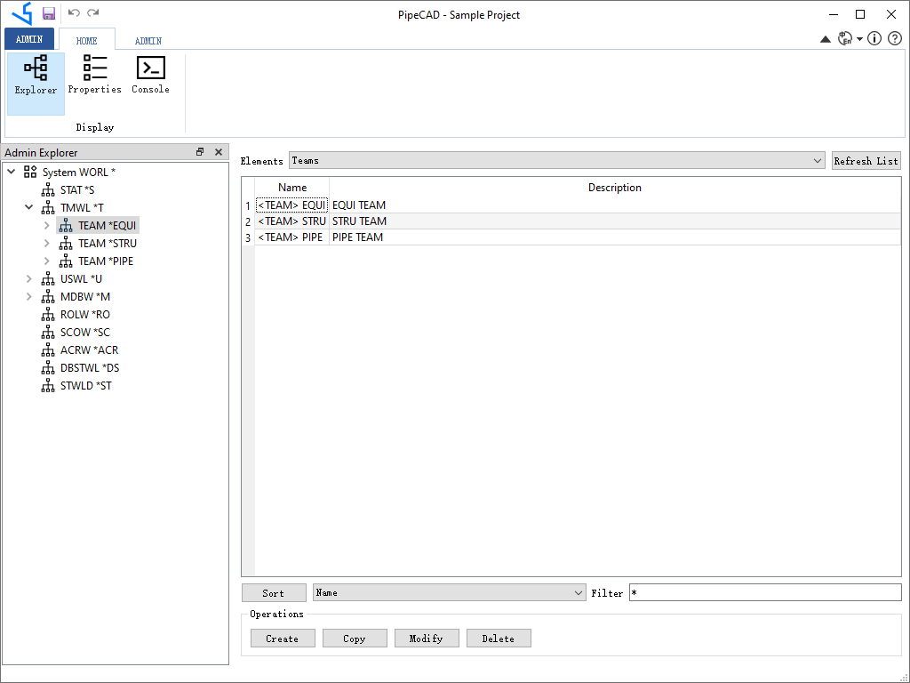

# PipeCAD User Guide {#pipecad_user_guide}

# 功能概述

三维管道设计软件PipeCAD即管道布置设计系统，适用于工厂、建筑、石油化工、环保医药等行业。管道设计中根据管道仪表流程图（P&ID）、设备布置图及有关的土建、仪表、电气，机泵等方面的图纸和资料为依据，对管道进行合理布置设计。管道布置设计首先应满足工艺要求，便于安装操作和维修，并要合理、整齐美观。通过管道三维建模，可以实现无碰撞的设计并快速生成可交付的成果，从而减少返工，提高设计效率。

软件采用独立的三维图形平台，不依赖其他第三方CAD平台（如AutoCAD等）。通过参数化设计，将设计数据保存到数据库，形成以项目数据库为核心的产品数据库。产品数据库为生成图纸及材料报表提供数据基础，也可为工厂数字化交付提供数据来源。

如上图所示，将参数化部件库及设计建模数据都保存到数据库中，在生成交付成果时，从数据库中提取所需数据，生成管道图纸及材料报表等。

PipeCAD主要分为三个模块，分别是项目管理Admin模块，参数部件Paragon模块和设计建模Design模块。
- 项目管理模块：创建用户和数据库，及用户对数据库的访问权限管理等。

- 参数部件模块：通过表格的数据输入，快速生成参数化部件，以及对管道，结构进行等级管理。在参数化部件库模块Paragon中将标准参数化管件的创建简化成表格数据输入的形式，减少工程数据准备的工作量，提高效率和准确性。

- 设计建模模块：在设计建模Design模块中对工厂建立三维模块。工厂模型主要包含以下几种类型：
    - 轴网Grid：方便各专业模型定位；
    - 设备Equipment：各种塔、罐、换热器、容器等。设备包含管嘴，方便管道连接定位；
    - 结构Structure：框架结构、厂房、设备平台梯子、栏杆扶手等；
    - 管道Piping：连接设备的管道、风管等模型；
    - 支吊架Hanger&Support：管道、风管等的支架；

通过交互操作产生工厂设计的数据保存到项目数据库中。

根据项目数据库，可以提取所需要的数据生成交付的设计成果：图纸和材料报表，以及数字化交付需要的其他数据。

PipeCAD还结合Python为软件提供灵活的二次开发功能，方便软件功能扩展。用户可以使用Python脚本根据自身需求定制开发新功能。

# 下载安装
PipeCAD是工业设计软件，面向石油化工、环保医药等行业的的工厂管道设计。只有用户使用和反馈才能让软件功能越来越完善。为了让更多用户使用正版工业设计软件，决定推出 **PipeCAD个人版(Personal Edition)** 和 **PipeCAD专业版(Professional Edition)** 两个版本。两个版本的核心功能是一样的，只有如下稍许区别：

| PipeCAD | **个人版(Personal Edition)** | **专业版(Professional Edition)** |
| :--- | :--- | :--- |
| 三维建模 | \emoji :heavy_check_mark: | \emoji :heavy_check_mark:   |
| 管道PCF文件 | \emoji :heavy_check_mark: | \emoji :heavy_check_mark:   |
| 管道材料报表 | \emoji :warning: 基本材料报表 | \emoji :heavy_check_mark: 根据公司模板定制 |
| 管道ISO图 | \emoji :warning: 固定图框 | \emoji :heavy_check_mark: 根据公司模板定制 |
| 设备管口方位图 | \emoji :warning: 固定图框 | \emoji :heavy_check_mark: 根据公司模板定制 |
| 管道平面布置图 | \emoji :x: | \emoji :heavy_check_mark: |

PipeCAD个人版(PipeCAD Personal Edition) **免费** 使用。

PipeCAD专业版(PipeCAD Professional Edition) **付费** 使用。

## 硬件要求
PipeCAD对硬件要求不高，但毕竟是三维软件，所以对显卡有要求，最好是独立显卡，且支持OpenGL3.3版本及以上。

| Component | Requirement |
| --- | --- |
| 内存 Memory | 1GB (推荐8GB) |
| 硬盘 Free Disk | 5GB (推荐100GB) |
|显卡 Graphics | 独立显卡，OpenGL3.3 |

## 软件要求
PipeCAD使用Visual Studio 2015开发，所以需要有Visual C++ Redistributable Packages for Visual Studio 2015，缺少VC的库程序会报错。Visual C++ Redistributable for Visual Studio 2015下载地址是： https://www.microsoft.com/zh-CN/download/details.aspx?id=48145

## 下载地址
   可以从如下地址下载PipeCAD个人版安装包：
   - https://github.com/eryar/PipeCAD/releases 
   - https://pan.baidu.com/s/1SwEwp-gHYJqLSb83tVJWtA?pwd=TUVA

安装PipeCAD后，自带的示例Sample项目的用户SYSTEM的密码是：6个大写的X，可以在Sample项目中体验PipeCAD功能。在使用PipeCAD之前，建议去B站查看PipeCAD的使用教程：  
https://space.bilibili.com/1548012589

# 项目管理
## 项目创建

# 视图操作

# 部件管理

## 管道部件
## 设备管口
## 结构型材

## 管道等级
## 管口等级
## 结构等级

# 轴网建模

# 设备建模

# 结构建模

# 管道建模

# 图纸生成

## 管道轴测ISO图

## 设备管口方位图

## 管道平面布置图

# 材料报表

# 定制开发
