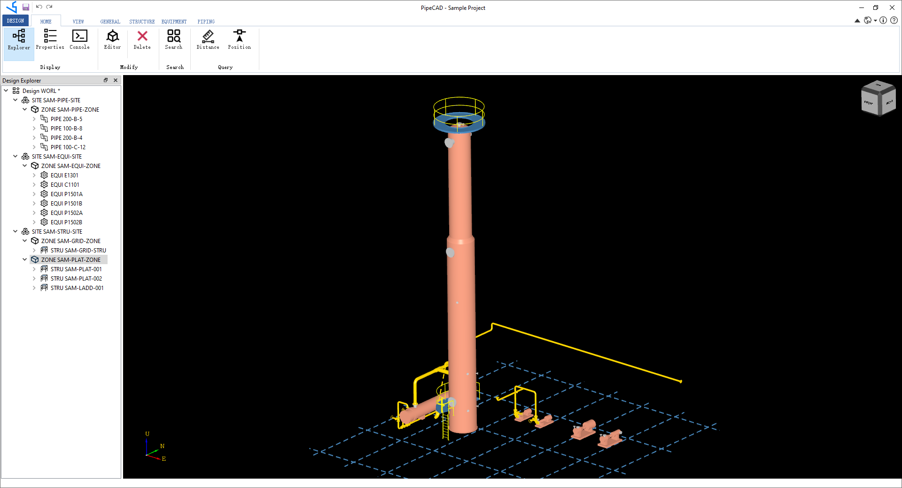
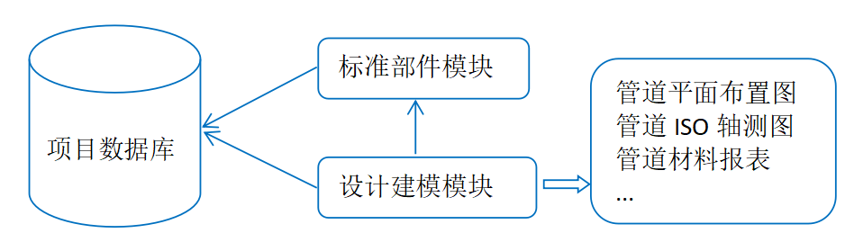

# PipeCAD User Guide {#pipecad_user_guide}

# 功能概述

三维管道设计软件PipeCAD即管道布置设计系统，适用于工厂、建筑、制药等行业。管道设计中根据管道仪表流程图（P&ID）、设备布置图及有关的土建、仪表、电气，机泵等方面的图纸和资料为依据，对管道进行合理布置设计。管道布置设计首先应满足工艺要求，便于安装操作和维修，并要合理、整齐美观。通过管道三维建模，可以实现无碰撞的设计并快速生成可交付的成果，从而减少返工，提高设计效率。

软件采用独立的三维图形平台，不依赖其他第三方CAD平台（如AutoCAD等）。通过参数化设计，将设计数据保存到数据库，形成以项目数据库为核心的产品数据库。产品数据库为生成图纸及材料报表提供数据基础，也可为工厂数字化交付提供数据来源。

如上图所示，将参数化部件库及设计建模数据都保存到数据库中，在生成交付成果时，从数据库中提取所需数据，生成管道图纸及材料报表等。

PipeCAD主要分为三个模块，分别是项目管理模块，参数部件模块和设计建模模块。
- 项目管理模块：创建用户和数据库，及用户对数据库的访问权限管理等；
- 参数部件模块：通过表格的数据输入，快速生成参数化部件，以及对管道，结构进行等级管理；
- 设计建模模块：

# 下载安装
PipeCAD 分个人版和专业版。

## 硬件要求

## 软件要求

## 下载地址
   可以从如下地址下载PipeCAD个人版安装包：
   - https://github.com/eryar/PipeCAD/releases 
   - https://pan.baidu.com/s/1SwEwp-gHYJqLSb83tVJWtA?pwd=TUVA

# 项目管理
## 项目创建

# 视图操作

# 部件管理

## 管道部件
## 设备管口
## 结构型材

## 管道等级
## 管口等级
## 结构等级

# 轴网建模

# 设备建模

# 结构建模

# 管道建模

# 图纸生成

## 管道轴测图

## 设备管口方位图

## 管道平面布置图

# 材料报表

# 定制开发
