# PipeCAD User Guide {#pipecad_user_guide}

# 软件概述

三维管道设计软件PipeCAD即管道布置设计系统，适用于石油化工、环保医药、工厂建筑等行业。管道设计中根据管道仪表流程图（P&ID）、设备布置图及有关的土建、仪表、电气，机泵等方面的图纸和资料为依据，对管道进行合理布置设计。管道布置设计首先应满足工艺要求，便于安装操作和维修，并要合理、整齐美观。通过管道三维建模，可以实现无碰撞的设计并快速生成可交付的成果，从而减少返工，提高设计效率。

软件采用独立的三维图形平台，不依赖其他第三方CAD平台（如AutoCAD等）。通过参数化设计，将设计数据保存到数据库，形成以项目数据库为核心的产品数据库。产品数据库为生成图纸及材料报表提供数据基础，也可为工厂数字化交付提供数据来源。

如上图所示，将参数化部件库及设计建模数据都保存到数据库中，在生成交付成果时，从数据库中提取所需数据，生成管道图纸及材料报表等。

PipeCAD主要分为三个模块，分别是项目管理Admin模块，参数部件Paragon模块和设计建模Design模块。
- 项目管理模块：创建用户和数据库，及用户对数据库的访问权限管理等。

- 参数部件模块：通过表格的数据输入，快速生成参数化部件，以及对管道，结构进行等级管理。在参数化部件库模块Paragon中将标准参数化管件的创建简化成表格数据输入的形式，减少工程数据准备的工作量，提高效率和准确性。

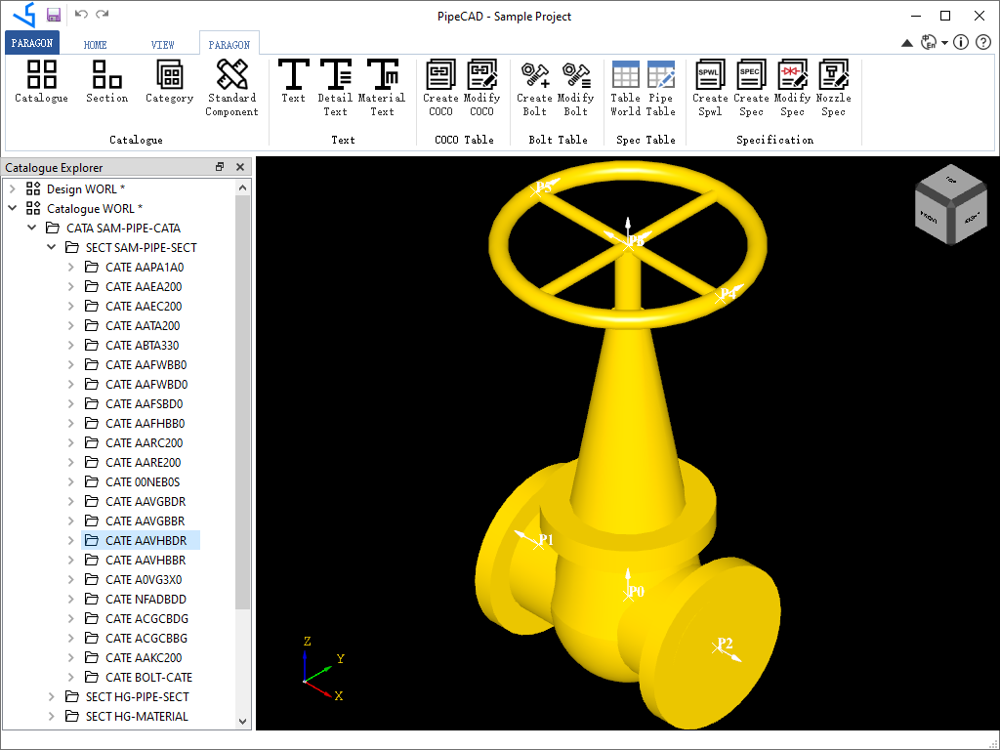

- 设计建模模块：在设计建模Design模块中对工厂建立三维模块。工厂模型主要包含以下几种类型：
    - 轴网Grid：方便各专业模型定位；
    - 设备Equipment：各种塔、罐、换热器、容器等。设备包含管嘴，方便管道连接定位；
    - 结构Structure：框架结构、厂房、设备平台梯子、栏杆扶手等；
    - 管道Piping：连接设备的管道、风管等模型；
    - 支吊架Hanger&Support：管道、风管等的支架；

通过友好的交互操作产生工厂设计的数据保存到项目数据库中。

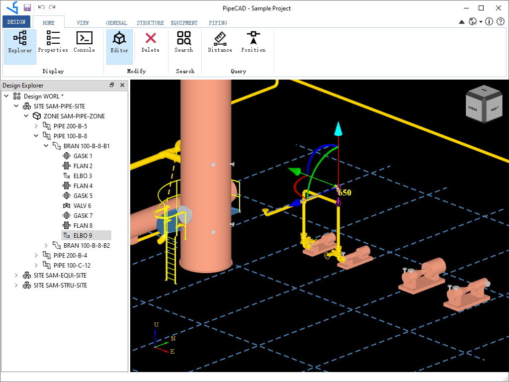

根据项目数据库，可以提取所需要的数据生成交付的设计成果：图纸和材料报表，以及数字化交付需要的其他数据。

PipeCAD还结合Python为软件提供灵活的二次开发功能，方便软件功能扩展。Python是面向对象的脚本语言，并且有很多Python的第三方库，如表格数据处理库pandas，DXF读写库ezdxf，等等，用户可以使用Python脚本根据自身需求定制开发新功能。

# 下载安装
PipeCAD是工业设计软件，面向石油化工、环保医药等行业的的工厂管道设计。只有用户使用和反馈才能让软件功能越来越完善。为了让更多用户使用正版工业设计软件，决定推出 **PipeCAD个人版(Personal Edition)** 和 **PipeCAD专业版(Professional Edition)** 两个版本。两个版本的核心功能是一样的，只有如下稍许区别：

| PipeCAD | **个人版(Personal Edition)** | **专业版(Professional Edition)** |
| :--- | :--- | :--- |
| 三维建模 | \emoji :heavy_check_mark: | \emoji :heavy_check_mark:   |
| 管道PCF文件 | \emoji :heavy_check_mark: | \emoji :heavy_check_mark:   |
| 管道材料报表 | \emoji :warning: 基本材料报表 | \emoji :heavy_check_mark: 根据公司模板定制 |
| 管道ISO图 | \emoji :warning: 固定图框 | \emoji :heavy_check_mark: 根据公司模板定制 |
| 设备管口方位图 | \emoji :warning: 固定图框 | \emoji :heavy_check_mark: 根据公司模板定制 |
| 管道平面布置图 | \emoji :x: | \emoji :heavy_check_mark: |

PipeCAD个人版(PipeCAD Personal Edition) **免费** 使用。

PipeCAD专业版(PipeCAD Professional Edition) **付费** 使用。

## 硬件要求
PipeCAD对硬件要求不高，但毕竟是三维软件，对显卡有要求最好是独立显卡，且支持OpenGL3.3版本及以上。

| Component | Requirement |
| :--- | :--- |
| 内存 Memory | 1GB (推荐8GB) |
| 硬盘 Free Disk | 5GB (推荐100GB) |
|显卡 Graphics | 独立显卡，OpenGL3.3 |

## 软件要求
对于Windows操作系统PipeCAD使用Visual Studio 2015开发，所以需要有Visual C++ Redistributable Packages for Visual Studio 2015，缺少Visual C++的动态库程序会报错。Visual C++ Redistributable for Visual Studio 2015下载地址是：

https://www.microsoft.com/zh-CN/download/details.aspx?id=48145

对于Linux操作系统，后期会用Qt Creator进行开发，也提供Linux支持。

## 下载地址
   可以从如下地址下载PipeCAD个人版安装包：
   - https://github.com/eryar/PipeCAD/releases 
   - https://pan.baidu.com/s/1SwEwp-gHYJqLSb83tVJWtA?pwd=TUVA

安装PipeCAD后，自带的示例Sample项目的用户SYSTEM的密码是：6个大写的X，可以在Sample项目中体验PipeCAD功能。在使用PipeCAD之前，建议去B站查看PipeCAD的使用教程：

https://space.bilibili.com/1548012589

## 安装软件
因为PipeCAD主要使用C++和Python开发，所以是可以跨平台使用的。目前主要是在Windows操作系统中完善功能细节，后期会在Linux操作系统中编译，使用户能在Linux系统中使用。

### Windows
PipeCAD在Windows系统中安装很简单，直接运行下载的安装包，将会看到欢迎界面并点击下一步Next：

在使用许可协议界面需要点同意并点击下一步Next：

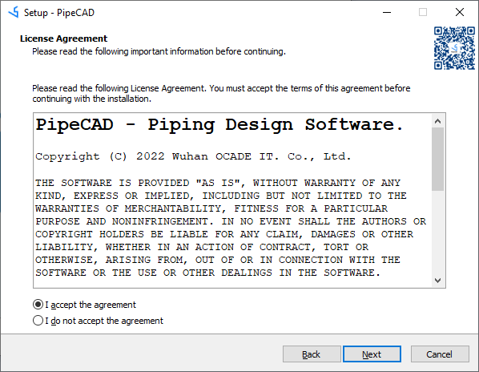

在安装目录界面上设置安装目录并点击下一步Next：

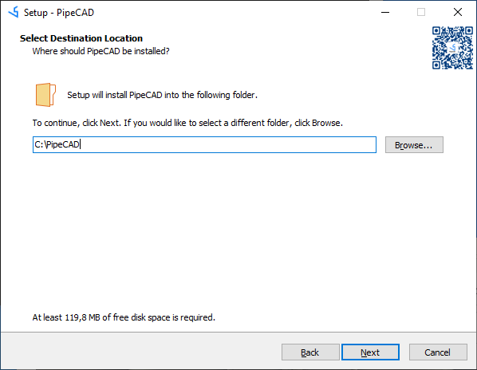

检查一下安装信息准确无误后可以点击安装Install进行安装：

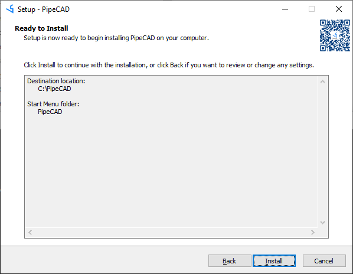

安装完成后，可以勾选README查看说明文档，及勾选运行程序选项启动PipeCAD：

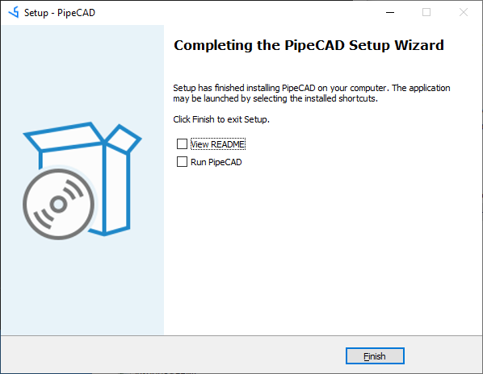

### Linux
TODO

## 登录系统
双击PipeCAD快捷图标或直接运行安装目录下的PipeCAD.bat可以启动软件。PipeCAD启动后显示登录界面：

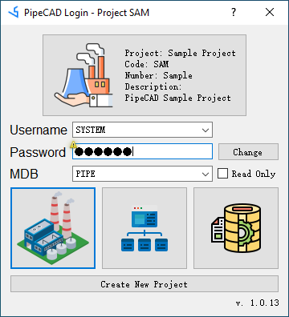

- 工程Project：选择要登录的工程名称；
- 用户名/密码：选择用户，输入对应的密码才能登录。每个工程都有一个默认的管理员用户SYSTEM，默认密码是XXXXXX（6个大写英文字母X）。用户密码可以在项目管理Admin模块中配置；
- 数据库组MDB：选择要登录的数据库组MDB；
- 模块Module：选择要登录的模型。目前有三大模块：项目管理模块Admin、参数化部件库模块Paragon和设计建模模块Design。

## 技术支持
虽然PipeCAD是面向工程设计行业的一款小众产品，但本着一颗产品人的心，持续学习，专注于工程设计行业三维软件的开发，我们会不断让PipeCAD好用、更好用。遇到不爽，欢迎大家反馈意见。我们时刻关注每一个用户提出的意见和建议，会认真对待每一个问题，您提的每个需求我们都会用心考虑，但由于人力上的限制，优先级上会有所不同，有些需求不能第一时间完成，也请小伙伴们谅解，我们将不断改善，努力做到更好，感谢小伙伴们的支持与厚爱，比心 \emoji :heart: 。PipeCAD还在不断开发完善中，如果您有任意意见、建议都可以向我们反馈：
- Github Issues: https://github.com/eryar/PipeCAD/issues
- PipeCAD 兔小巢： https://support.qq.com/products/369895/
- 电子邮箱： pipecad@qq.com 或者 eryar@163.com

对于提出建设性的建议或其他参与贡献的贡献者会在软件的关于对话框中列出。感谢贡献者的参与让PipeCAD越来越好！

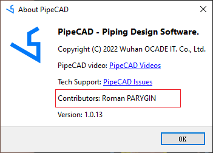

# 常用操作
PipeCAD中数据都是以树形层次组织的，所以在各个模块中都提供树形视图。对应树结构上每个节点都是一个对象，不同的对象有不同的属性。PipeCAD集成Python开发语言，可以用Python进行定制功能开发。设计模块的模型编辑器Model Editor可以方便地调整模型的位置，在设计模块中通过查询功能可以方便地查询距离和坐标信息。

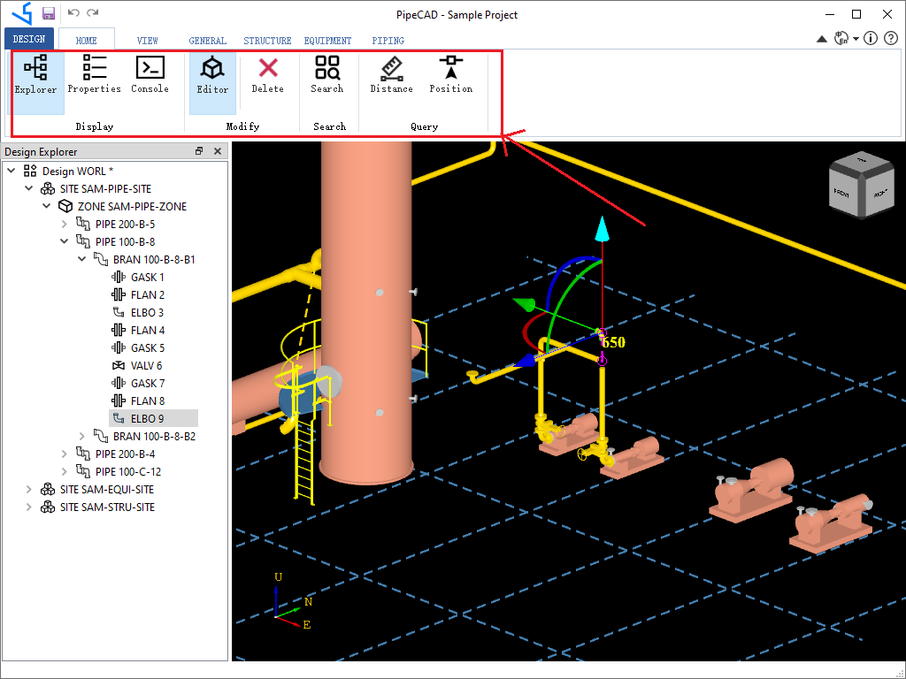

在PipeCAD的通用操作面板上列出常用的功能，主要有显示/隐藏树形视图Explorer、显示/隐藏属性列表Properties、显示/隐藏Python命令窗口Console。

- 树形视图：通过点击  来显示/隐藏树形视图。
- 属性列表：通过点击  来显示/隐藏属性列表。

- 命令窗口：通过点击  来显示/隐藏命令窗口。

- 模型编辑：通过点击  来启用/关闭模型编辑器功能。

- 数据删除：通过点击 来删除选择的树节点。

- 距离查询：通过点击  启动距离查询功能后，在模型上选择两个点来进行距离查询。

- 坐标查询：通过点击  启动坐标查询功能后，在模型上选择点来进行坐标查询。

# 视图操作
在参数部件Paragon模块和设计建模Design模块都有三维视图，对于三维视图的操作是一致的。对于三维视图，提供常用的移动、旋转和缩放功能，都是可以通过鼠标实现。有些功能是在菜单面板中，如设置视图方向，视图背景颜色以及在视图中显示哪些模型等。

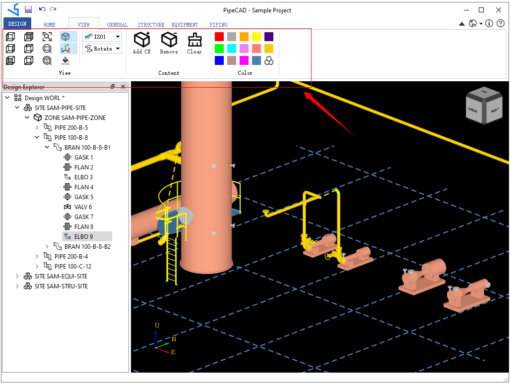

- 视图方向：提供设置六个视图方向及四个ISO视图方向。
  -  设置视图投影方向为后视图；
  -  设置视图投影方向为前视图；
  -  设置视图投影方向为左视图；
  -  设置视图投影方向为右视图；
  -  设置视图投影方向为仰视图；
  -  设置视图投影方向为俯视图；

- 视图缩放：
  -  缩放显示视图中全部模型
  -  缩放显示选择的模型
  -  缩放并居中显示选择的模型

- 显示模式：  着色渲染/线框模式切换。

- 视图背景：  设置视图背景颜色。

- 鼠标中键：拖动鼠标中键可以对视图进行移动Pan、旋转Rotate和缩放Zoom。默认是旋转，可以通过下拉选项框选择不同的方式。
  -  移动视图
  -  旋转视图
  -  缩放视图 

- 模型管理：主要用来显示/隐藏选择树节点对应的模型，以及清空三维视图功能。
  -  在参数部件Paragon模块，在树形视图上选择CATE节点，可以显示参数部件模型。在设计建模Design模块，可以显示在树形视图上选择的节点对应的模型。
  -  在参数部件Paragon模块，可以隐藏参数部件模型。在设计建模Design模块，可以隐藏要树形视图上选择的节点对应的模型。
  -  清空三维视图 

- 右键菜单：将三维视图常用的操作也放到三维视图的右键菜单中，给用户更好的视图交互体验。当在三维视图中空白处点击右键时，出现的右键菜单如下：

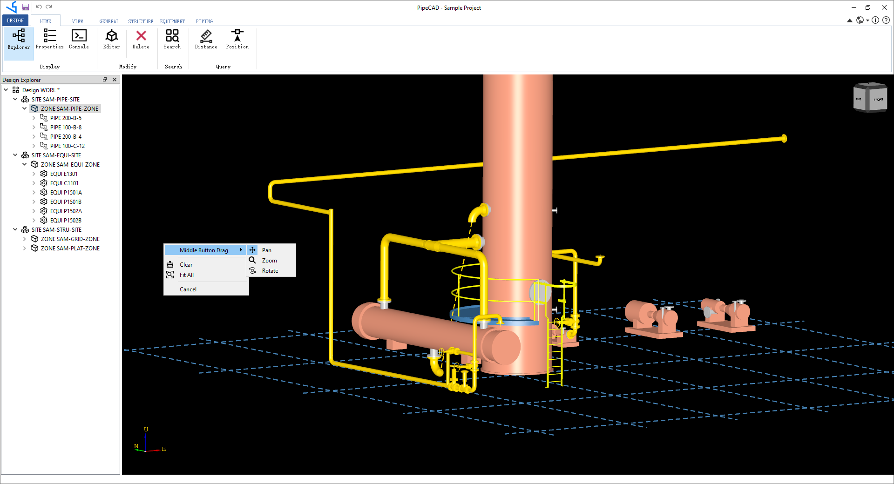

当在三维视图选择的有模型时，弹出的右键菜单如下：

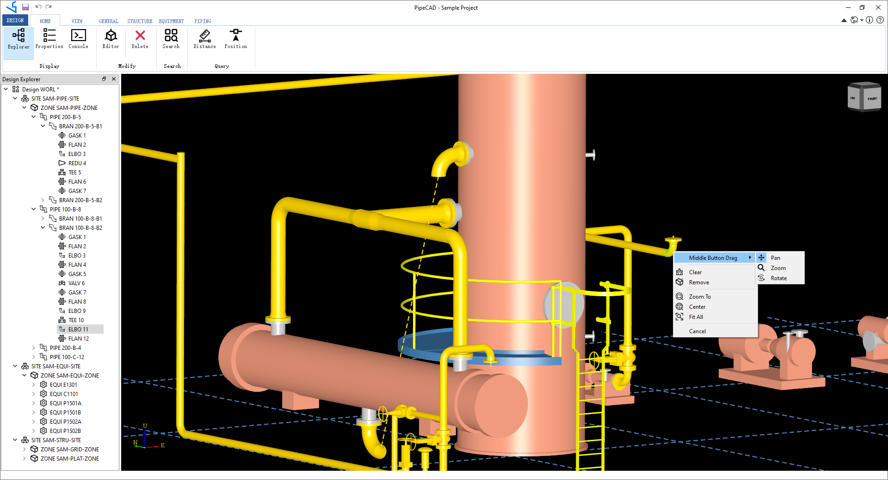

可以在右键菜单中直接设置鼠标中键拖动选项；通过Remove可以隐藏选择的模型；通过Clear可以清空三维视图中的模型；通过Zoom To缩放到选择的模型；通过Center将选择的模型设置成视图的中心；通过Fit All可以将三维视图中的模型全部显示出来。

- 视图方块：视图的一些操作还可以通过视图右上角的方块来实现。当鼠标移动到视图方块上时，点击高亮的部分，可以切换视图方向。若选择了模型，则会将选择的模型置于视图中心。若没有选择模型，则会缩放全部模型。

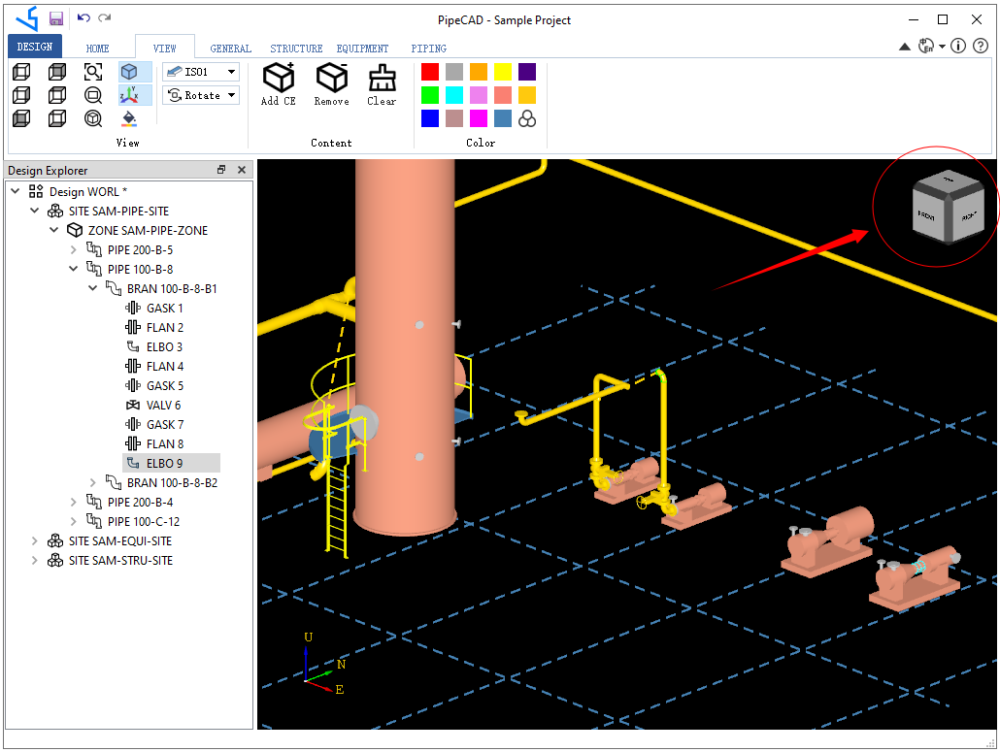 

# 项目管理
工程设计一般都是按项目进行，所以PipeCAD也是按项目进行数据的管理。当创建项目后，会自动生成项目所需要的文件夹及系统数据库。为了进行项目设计，还需要在项目管理模块Admin中对项目进行配置，如增加元件数据库、设计数据库等；规划工作组Team，创建用户及分配权限。

## 项目创建
通过运行安装目录的批处理文件ProjectCreation.bat来启动创建项目程序。输入项目编号，名称，代码和描述，项目存储路径等信息。其中项目编号Number是项目根文件夹的名称；项目代码Code是不与其他项目冲突的三个大写字母代码。项目环境变量配置Project Variables用来设置项目所需文件夹路径，根据项目代码Code自动生成。 

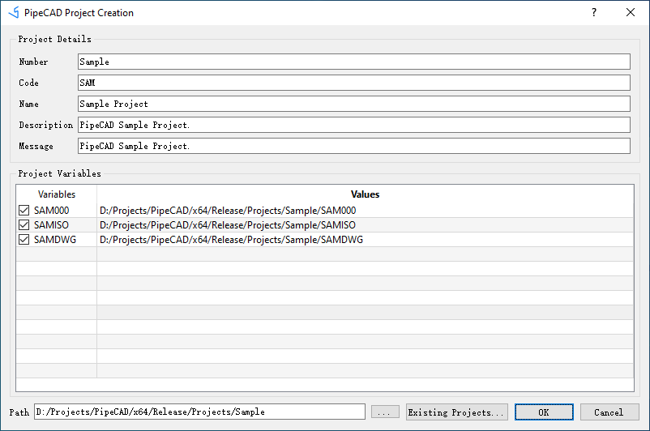

点击OK按钮来创建项目，项目创建成功会给出如下图所示的提示信息：

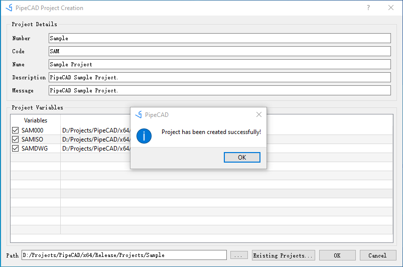

并在项目文件夹中生成项目所需要的数据库文件及其他配置文件：

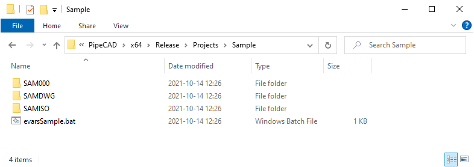

其中批处理文件evarsSample.bat为项目所需路径的环境变量配置文件。当创建已经存在的项目时，会给出提示：

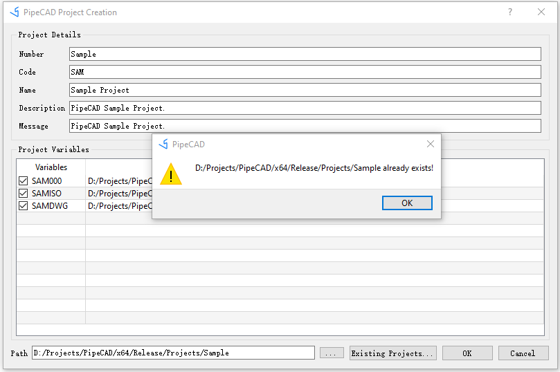

当必须输入的数据没有输入时，也会给出提示：

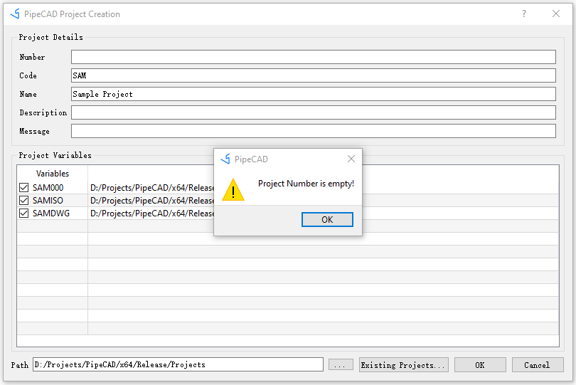

## 项目信息
项目信息是项目的描述性信息，如项目名称、项目代号、项目描述等。在创建项目时填写了项目信息，如果需要对项目信息进行修改，可以在Admin面板中打开项目信息对话框修改项目信息。

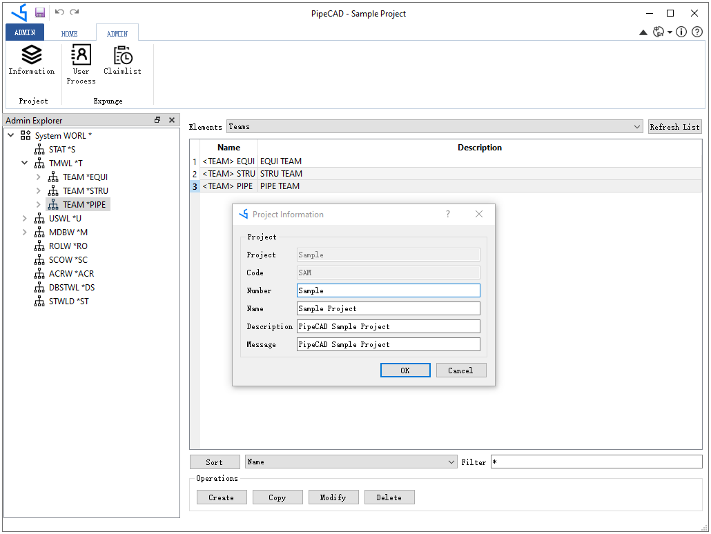

## 分组管理
对于工厂项目而言，一般会按专业、系统、区域进行分工协同设计，在PipeCAD软件中使用分组Team的方式来进行管理。通过对用户和数据库进行分组，最终来实现全厂的项目设计建模。

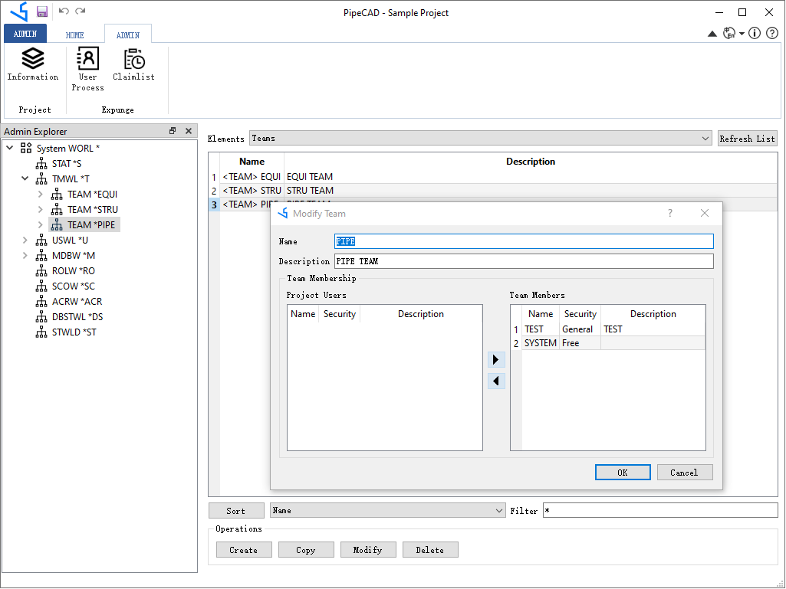

通过分组Team也可以用来控制用户的读写权限。分组Team包含的用户才能对分组的数据库有读写权限，项目中其他用户则只有读的权限。用户可以属于多个分组。

## 数据库管理
PipeCAD是以项目数据为核心的三维设计软件，设计建模数据都是以数据库的形式保存起来。在项目管理模块Admin中，可以根据需要创建所需要的数据库Database。数据库从属于分组Team，创建数据库时首先要指定分组。数据库的命令规则是：TeamName/DatabaseName。一个分组Team可以包含多个数据库，如元件库、设计库等。创建数据库界面如下：

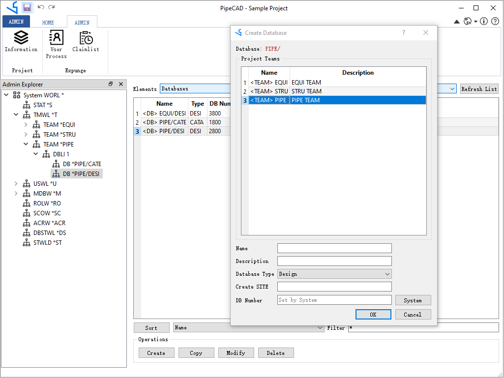

创建数据库时需要指定数据库名称，类型，还可以创建数据库的根据节点，对应设计数据库，可以创建一个SITE。每个数据库还有一个项目唯一的编号DB Number。这个编号可以自己输入，也可以由系统System自动生成。创建完成后会生成一个以项目代号及数据库编号命名的数据库文件。

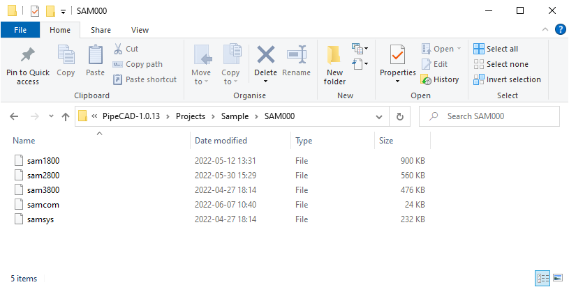

## 工作区管理
在PipeCAD中通过分组Team已经对工程设计进行了一个分解，还可以通过工作区MDB来对工程设计进一步分解。MDB（Multiple Databases）字面意思就是包含数据库的一个集合。当用户登录时选择了一个MDB，则该用户只能对这个MDB中的数据库可见，项目中其他数据库不可见。通过工作区MDB，对数据的读写权限进行控制，如果让一个工作区内的数据尽量显示与其工作内容相关的数据，而不需要为整个项目的数据。

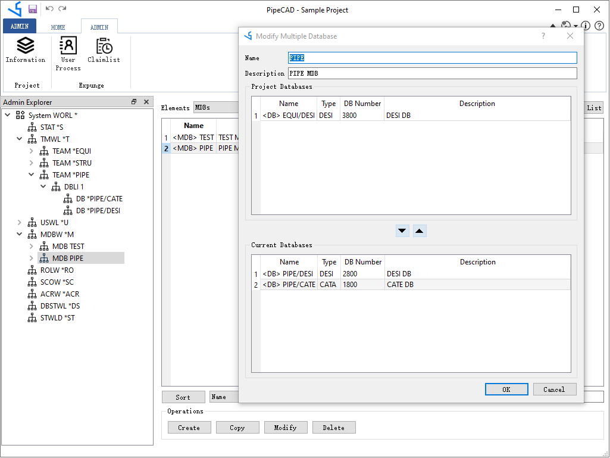

创建MDB时输入名称和描述，再选择属于这个工作区MDB的数据库DB即可。工作区MDB中的数据库顺序就是设计导航Design Explorer中的显示顺序。工作区中的数据库顺序会影响到数据库第一个元素的创建。创建第一个元素时，可将写数据库放在同类型数据库的第一个。所以为了方便，在创建数据库Database时，提供创建第一个元素的功能。

## 用户管理
在PipeCAD的登录界面上还需要输入用户名及密码。这些数据的管理在User部分。用户权限有两种类型：General和Free。在创建项目时，会默认创建一个Free权限的系统管理员SYSTEM，密码是6个大写的X。Free权限的用户属于系统管理员，可以进入所有模块，及读写所有数据库的权限。General用户只能进入Paragon和Design模块，不能进入管理模块Admin，用户只能对属于分组的数据库才有读写权限。

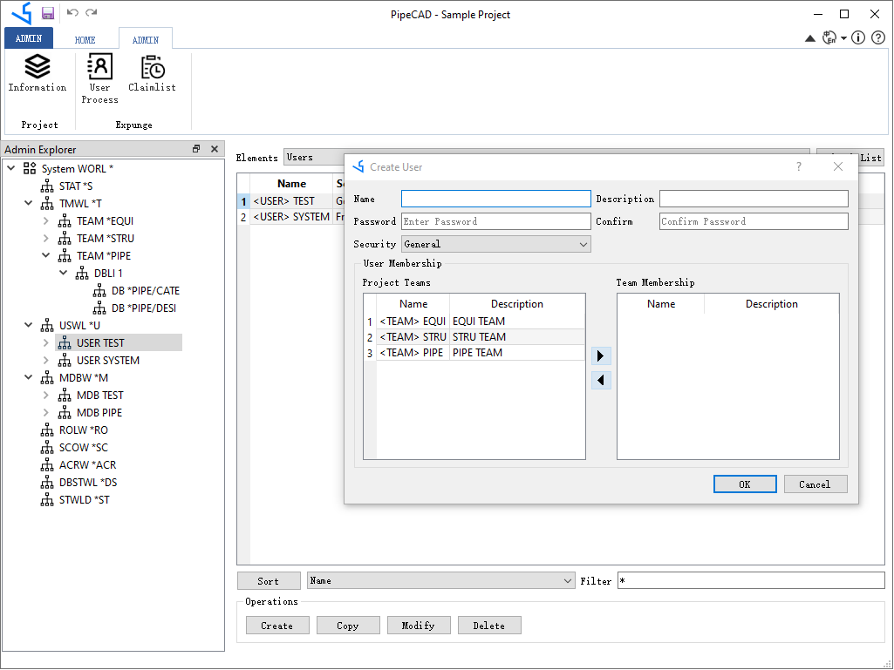

创建用户时，需要输入用户名和密码，以及选择用户权限，还要指定用户属于哪个分组Team。

# 部件管理
在管道设计过程中会使用大量的标准管件，为了方便标准管件的建模，通过参数化的方式来定义管件，在设计模块中引用标准管件的数据，实现管道模型的创建。在PipeCAD中标准管件的数据定义是通过Paragon模块来实现。

工厂设计常用的管道标准件有管子、法兰、弯头、三通、阀门等，型材标准件有各种型钢：工字钢、T型钢、球扁钢、圆钢等。在Paragon模块中通过参数集Parameter Set、点集Point Set和形集Geometry Set来实现任意管件的参数化建模。Paragon模块提供可视化环境来定义各种复杂的元件，特殊元件的建立不需要编程。由于常用标准件的外形都是固定的，变化的只是尺寸参数。所以通过将标准件根据类型分类，把标准件的建库工作简化成数据表格输入，提高效率。因为标准元件数量很大，为了确保元件不重名，建议使用一套编码规则来对元件和等级进行命名。命名有一定含义也可以为设计带来方便，并可以根据名字在PipeCAD中查找定位。

## 命名规则
PipeCAD要求数据库中的每一个元素有唯一的名字，即数据库中不能有重名的元素。所以建议使用编码规则来保证一个元素有唯一的名字，在使用过程中经常要用到，例如：
- 元件库中的元件命名；

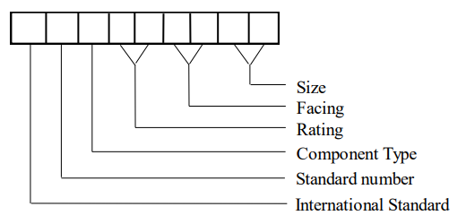

- 描述文字的名称；
- 点集名称，形集名称；
- 连接形式名称；

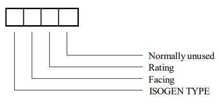

- 等级名称；在化工标准HG 20519.38中有关于管道等级的命名规则说明：

## 管道部件

## 管道等级
管道材料等级Specification是根据设计温度、设计压力和输送介质的要求，以及材料的性能和经济合理性确定管道和管道组成件的材质、品种和规格型号应根据工艺管道及仪表流程图（PID）上的管道材料等级选用。管道材料等级表中所列设计压力是指设计温度下允许的最高设计压力，实际压力应不大于此值方可选用该等级。

管道等级在设计软件中的体现就是帮助设计人员快速选择所需要的管件，避免错误。即设计模型中选择的管件，是通过等级来筛选的。设计模型通过属性spref来关联元件库的模型。每个等级部件Spec Component包含管件的模型引用catref，及材料描述引用datref。Catref指向管件的三维模型。datref为材料的参数化描述，及与ISO图相关的SKEY定义。管道等级中还关联其他信息，如螺栓等级，材料壁厚等等。其引用关系如下：

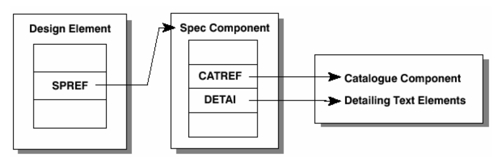 

## 设备管嘴
设备管嘴Nozzle是设备与管道连接的接口，通过把管嘴Nozzle建模，可以为管道建模时首尾点定位提供便利。

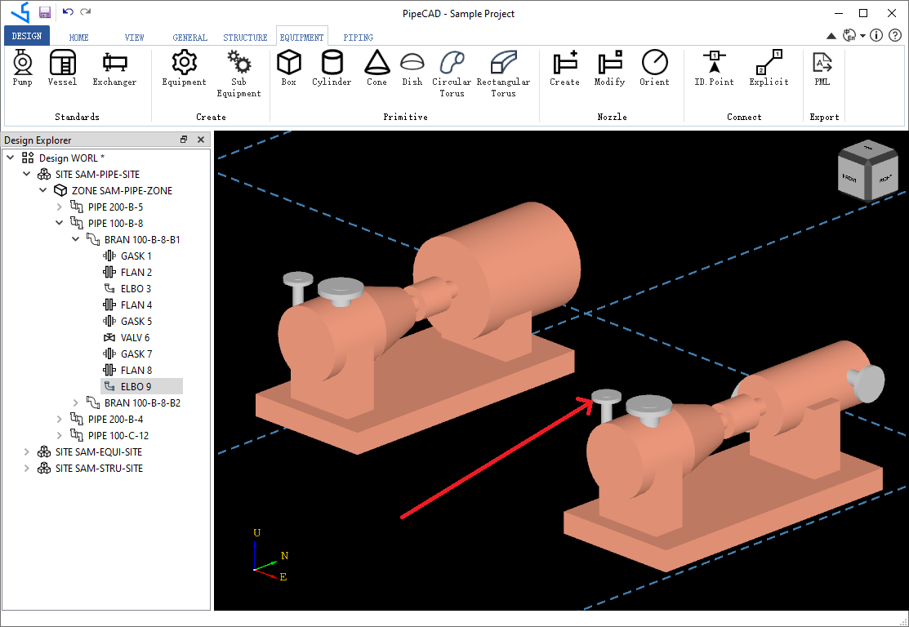 

设备管嘴与管道的连接形式有对焊、承插焊、法兰以及螺纹连接等。将管嘴根据SKEY分类，把标准管嘴的建库工作简化成表格的数据输入。

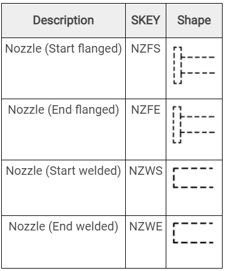

管嘴的长度是由设计模块中的管嘴属性Height最终确定，所以程序也实现了由设计模块中的属性来驱动参数化管嘴的模型变化。

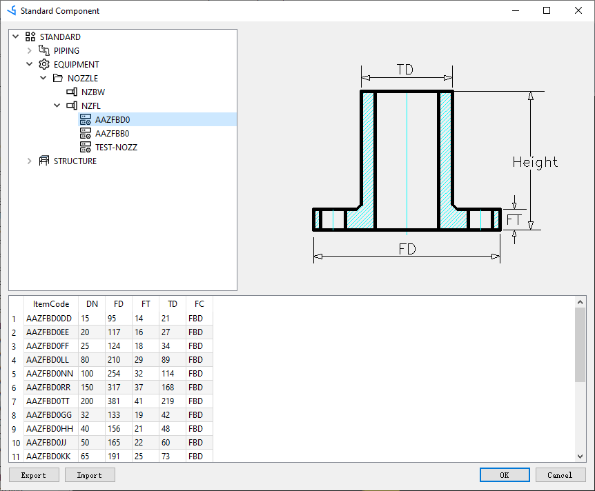

通过在表格中输入对应的参数，可以快速生成管嘴的参数化模型。

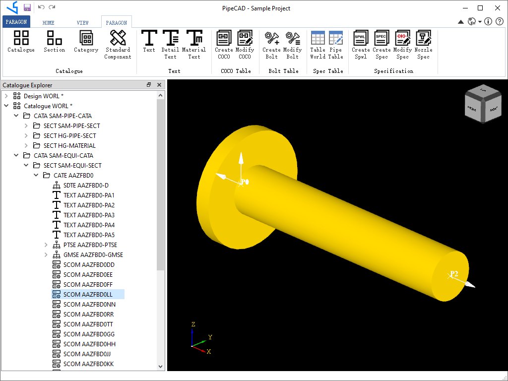

## 管嘴等级

## 结构型材
型钢在工程设计中有大量应用：如厂房的主体框架结构；设备的基座；支架；电缆托架；梯子平台等。PipeCAD提供结构建模功能，软件功能基本包括设备、管道、结构，可以用于实际工厂设计。

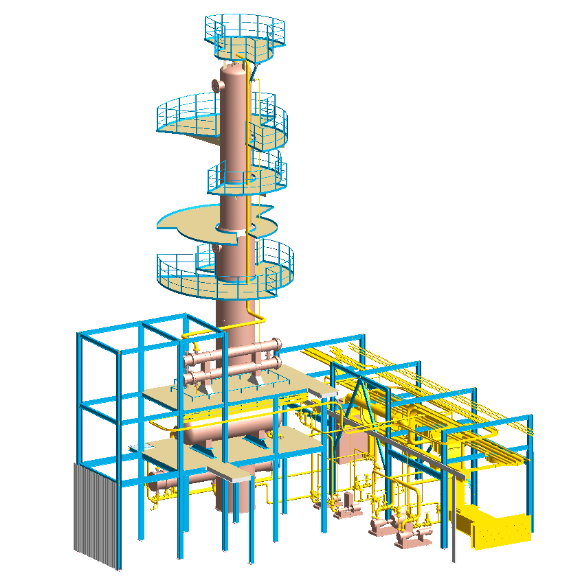

结构型材库和管道元件库类型，也是由树形结构来组织数据：

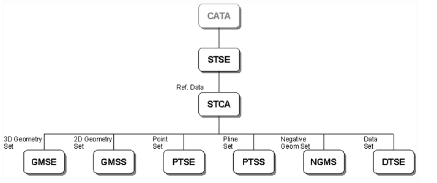

在其图形集合GMSS中，只有三种类型，最常用的是定义一个型材的轮廓SPRO，轮廓由一系列带圆弧半径的点SPVE组成。通过这种方式，可以定义型材的带倒圆角的轮廓。在其特征线集合PTSS中，定义一些定位线PLINE。在结构建模过程中，需要使用这些定位线PLINE来对型材进行定位。如对于一个首尾位置确定的等边角钢，指定不同对齐线时，角钢在模型中的位置会有不同。实际设计过程中使用到的型材类型是确定的，为了简化用户建库，将型材的建库简化成表格输入，省去从形集GMSS和特征线集PTSS等手工创建的繁琐过程。如下图所示为等边角钢的尺寸参数图示：

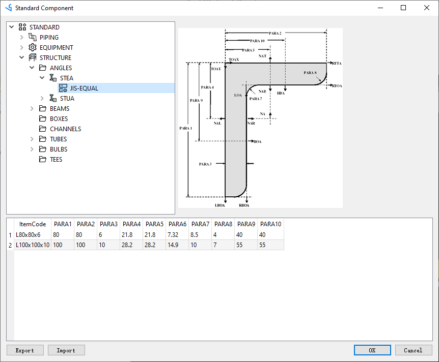

查找到等边角钢标准数据后，在表格中输入对应的尺寸参数，即可自动生成等边角钢的形集GMSS和特征线集PTSS。其中形集主要由拉伸体组成。

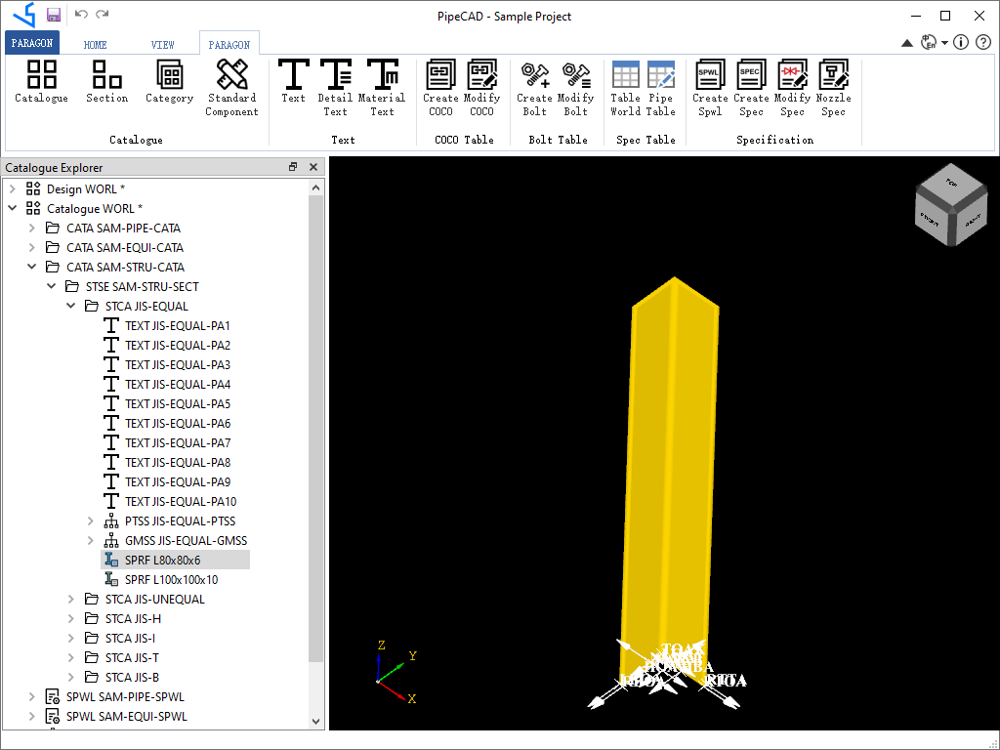

## 结构等级

# 轴网建模
## 创建轴网
轴网Grid在系统中使用没有等级Spec的型材来表示，在三维视图中会显示成虚线。结构轴网的主要作用是：
- 为管道、结构等多专业协同设计提供定位参考；
- 为管道ISO图提供定位参考；
- 为管道平面布置图中绘制轴网及轴网标识号及尺寸标注作定位参考；

在软件PipeCAD中提供创建及显示轴网的用户界面如下图所示：

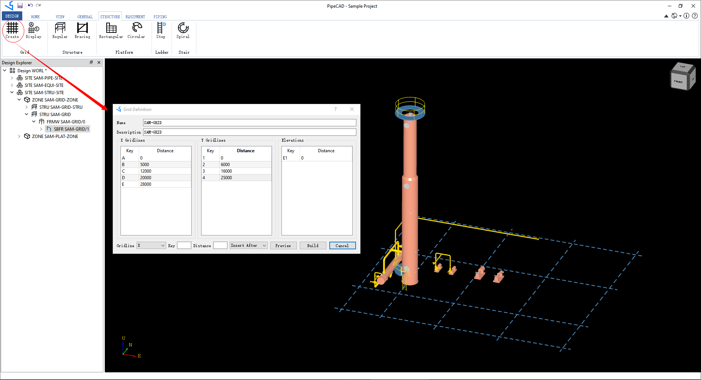

通过设置X，Y和Z三个方向上的坐标，来快速生成轴网。生成之前可以使用预览功能Preview。预览生成的是辅助线和文字，不是实际模型。预览结果符合预期，可以点击生成Build来生成轴网模型。

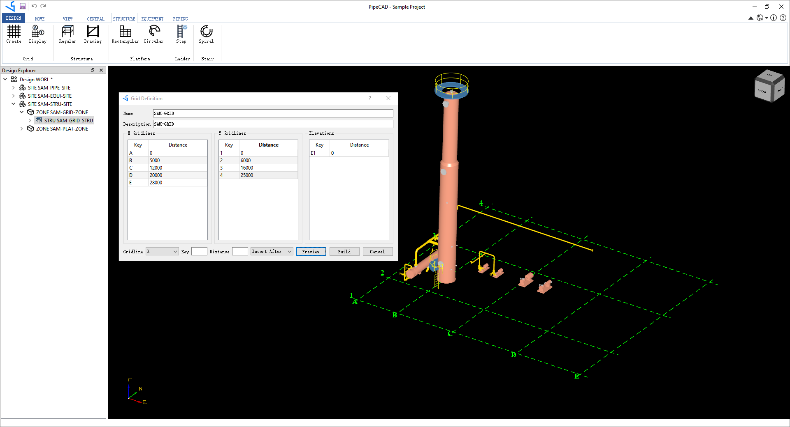

## 显示编号
在管道设计过程中，可以通过显示轴网编号功能显示出轴网的编号，方便设计人员对模型进行定位。通过结构面板STRUCTURE上的显示轴网功能来实现：

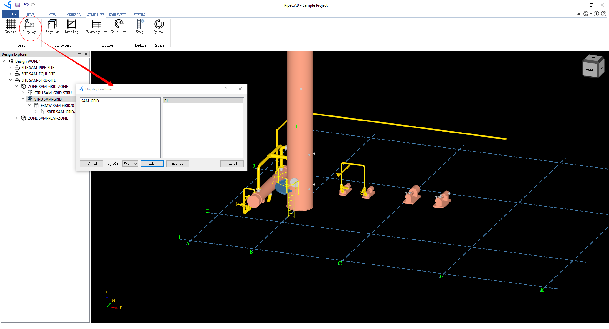

选择要显示轴网编号的STRU节点，可以显示轴网的编号Key。还可以显示轴网的名称：

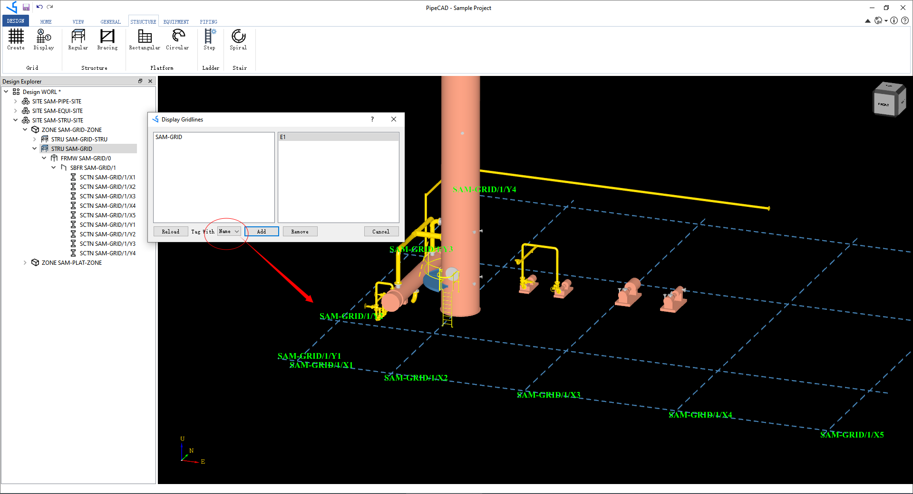

# 设备建模

# 结构建模

# 管道建模

# 图纸生成

## 管道轴测ISO图

## 设备管口方位图

## 管道平面布置图
TODO

# 材料报表
TODO

# 定制开发
